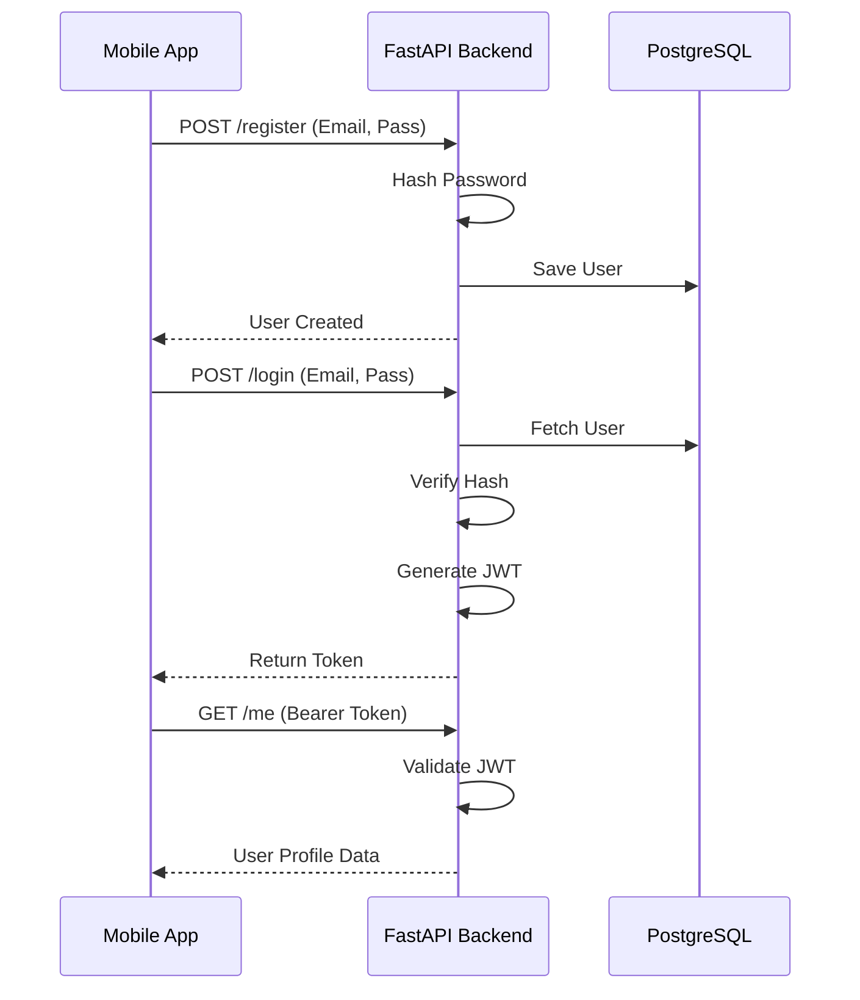

# Implementation Plan - Phase 22: Authentication Service & JWT

Implement a secure, production-ready authentication system for the **MediAI Enterprise** backend, providing the foundation for user identity and secure data access.

## User Review Required

> [!IMPORTANT]
> This phase establishes the security perimeter of the backend.
>
> - **Security Standards**: We will use **OAuth2 with Password Flow** and **JWT (JSON Web Tokens)** for stateless authentication.
> - **Password Safety**: Passwords will be hashed using **Bcrypt** with a salt before storage.
> - **Stateless Session**: All sensitive health APIs will require a valid JWT token in the `Authorization: Bearer` header.

## Proposed Changes

### Security Utilities (`backend/app/core`)

#### [NEW] [security.py](file:///J:/Android/AndroidStudioProjects/Gemini/Ai-HealthCare-App/backend/app/core/security.py)
- Implement `get_password_hash` and `verify_password` using `passlib`.
- Implement `create_access_token` using `python-jose` for JWT generation.

### API Schemas (`backend/app/schemas`)

#### [NEW] [user.py](file:///J:/Android/AndroidStudioProjects/Gemini/Ai-HealthCare-App/backend/app/schemas/user.py)
- Define `UserCreate`, `UserUpdate`, and `UserResponse` Pydantic models.
- Define `Token` and `TokenData` models.

### API Endpoints (`backend/app/api/v1/endpoints`)

#### [NEW] [auth.py](file:///J:/Android/AndroidStudioProjects/Gemini/Ai-HealthCare-App/backend/app/api/v1/endpoints/auth.py)
- **POST /register**: Create a new user and return user data.
- **POST /login**: Authenticate user and return an Access Token.

### Middleware & Dependencies (`backend/app/api`)

#### [NEW] [deps.py](file:///J:/Android/AndroidStudioProjects/Gemini/Ai-HealthCare-App/backend/app/api/deps.py)
- Implement `get_current_user`: A FastAPI dependency that extracts and validates the JWT token, returning the authenticated `User` model.

### Main App Updates

#### [MODIFY] [main.py](file:///J:/Android/AndroidStudioProjects/Gemini/Ai-HealthCare-App/backend/app/main.py)
- Include the `auth` router in the FastAPI application.

## Authentication Sequence

## Verification Plan

### Automated Tests
- **Unit Tests**: Verify hashing and password verification.
- **Integration Tests**: Test the full registration and login flow using a test database.

### Manual Verification
- Use the Swagger UI (`/docs`) to register a test user.
- Log in and verify that a valid JWT token is returned.
- Test a protected endpoint with the received token.
