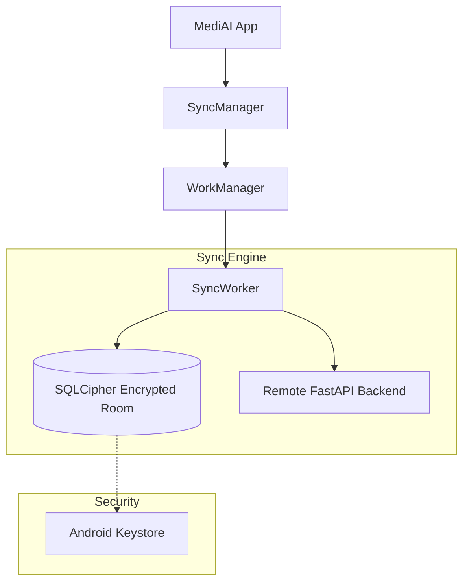

# Implementation Plan - Phase 16: Security & Offline Sync

Implement enterprise-grade local data security and a robust background synchronization engine for **MediAI Enterprise**.

## User Review Required

> [!IMPORTANT]
> This phase focuses on data integrity and privacy at rest and in transit.
>
> - **Database Encryption**: We will integrate **SQLCipher** with Room to encrypt the entire local database using AES-256.
> - **Offline-First Sync**: We will implement a "Delta Sync" strategy using **WorkManager**, ensuring local changes are pushed to the server and remote updates are pulled seamlessly.
> - **Secure Key Management**: The database encryption key will be stored securely in the **Android Keystore**.

## Proposed Changes

### Build Configuration

#### [MODIFY] [libs.versions.toml](file:///J:/Android/AndroidStudioProjects/Gemini/Ai-HealthCare-App/gradle/libs.versions.toml)
- Add **SQLCipher** and **SQLite KTX** dependencies.

### Core Database (`:core:database`)

#### [MODIFY] [DatabaseModule.kt](file:///J:/Android/AndroidStudioProjects/Gemini/Ai-HealthCare-App/core/database/src/main/kotlin/com/mediai/enterprise/core/database/di/DatabaseModule.kt)
- Configure `SupportFactory` for Room using a dynamic key from Keystore.

### Core Data (`:core:data`) [NEW SERVICES]

#### [NEW] [SyncWorker.kt](file:///J:/Android/AndroidStudioProjects/Gemini/Ai-HealthCare-App/core/data/src/main/kotlin/com/mediai/enterprise/core/data/sync/SyncWorker.kt)
- A `CoroutineWorker` that orchestrates the sync process for all entities (Reports, Appointments, Vitals).

#### [NEW] [SyncManager.kt](file:///J:/Android/AndroidStudioProjects/Gemini/Ai-HealthCare-App/core/data/src/main/kotlin/com/mediai/enterprise/core/data/sync/SyncManager.kt)
- Responsible for triggering syncs based on network availability and data changes.

### Entity Updates

#### [MODIFY] [All Room Entities](file:///J:/Android/AndroidStudioProjects/Gemini/Ai-HealthCare-App/core/database/src/main/kotlin/com/mediai/enterprise/core/database/entity/)
- Add `lastUpdated` timestamp and `isDirty` flag to all entities to support delta sync.

### Security Utilities (`:core:security`)

#### [NEW] [KeyStoreManager.kt](file:///J:/Android/AndroidStudioProjects/Gemini/Ai-HealthCare-App/core/security/src/main/kotlin/com/mediai/enterprise/core/security/KeyStoreManager.kt)
- Manage generation and retrieval of the database encryption key using Android Keystore.

## Architecture Diagram

## Verification Plan

### Automated Tests
- **Security Tests**: Verify that the database file cannot be read without the correct SQLCipher key.
- **Sync Tests**: Verify that "Dirty" items are correctly identified and processed by the `SyncWorker`.

### Manual Verification
- Modify data in offline mode, then enable Wi-Fi and verify the sync triggers.
- Check the app's performance during background synchronization.
- Verify that clearing app data also clears the secure keys in Keystore (standard behavior).
