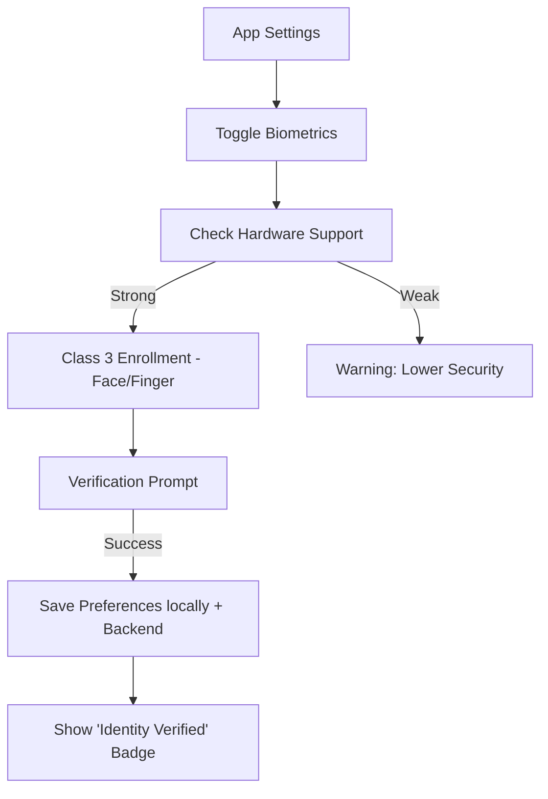

# Implementation Plan - Phase 36: Face Authentication & Advanced Biometrics

Implement specialized biometric identity verification, specifically focusing on "Face Auth" and advanced identity state management for **MediAI Enterprise**.

## User Review Required

> [!IMPORTANT]
> This phase focuses on the **Identity Layer**.
>
> - **Biometric Type Preference**: We will allow users to specifically enable/disable Face vs Fingerprint authentication (where supported by hardware).
> - **Identity State**: We will introduce an `identityVerified` flag in the user profile, which is set only after a high-integrity (Class 3) biometric success.
> - **Hardware Fallback**: If Face hardware is unavailable, the app will gracefully fall back to Fingerprint or Device PIN.

## Proposed Changes

### Core Security (`:core:security`)

#### [MODIFY] [BiometricAuthenticator.kt](file:///J:/Android/AndroidStudioProjects/Gemini/Ai-HealthCare-App/core/security/src/main/kotlin/com/mediai/enterprise/core/security/BiometricAuthenticator.kt)
- Add methods to detect specific biometric types (Face vs Fingerprint).
- Support for `BIOMETRIC_WEAK` (Class 2) and `BIOMETRIC_STRONG` (Class 3) detection.

### Feature Authentication (`:feature:auth`)

#### [NEW] [BiometricEnrollmentScreen.kt](file:///J:/Android/AndroidStudioProjects/Gemini/Ai-HealthCare-in/src/main/kotlin/com/mediai/enterprise/feature/auth/presentation/biometric/BiometricEnrollmentScreen.kt)
- A screen to explain the benefits of biometric security and allow users to opt-in.
- Visual cues for "Face" focus (e.g., face outline icon).

### Core Data (`:core:data`)

#### [MODIFY] [user_prefs.proto](file:///J:/Android/AndroidStudioProjects/Gemini/Ai-HealthCare-App/core/data/src/main/proto/user_prefs.proto)
- Add `biometric_enabled` and `preferred_biometric_type` fields.

### Backend Updates (`backend/app`)

#### [MODIFY] [user.py](file:///J:/Android/AndroidStudioProjects/Gemini/Ai-HealthCare-App/backend/app/models/user.py)
- Add `biometric_verified` (Boolean) and `last_biometric_auth` (DateTime) to the `User` model.

## Identity Flow

## Verification Plan

### Automated Tests
- **Unit Tests**: Verify preference mapping for different biometric types.
- **Unit Tests**: Verify that `BiometricAuthenticator` correctly handles "Not Enrolled" scenarios.

### Manual Verification
- Go to Settings -> Security and toggle Biometrics.
- Verify the specific iconography for "Face" appears if the device supports it (e.g., Pixel 4/7/8).
- Log out and log back in using only face/fingerprint.
- Check the Backend database to ensure `biometric_verified` is updated.
