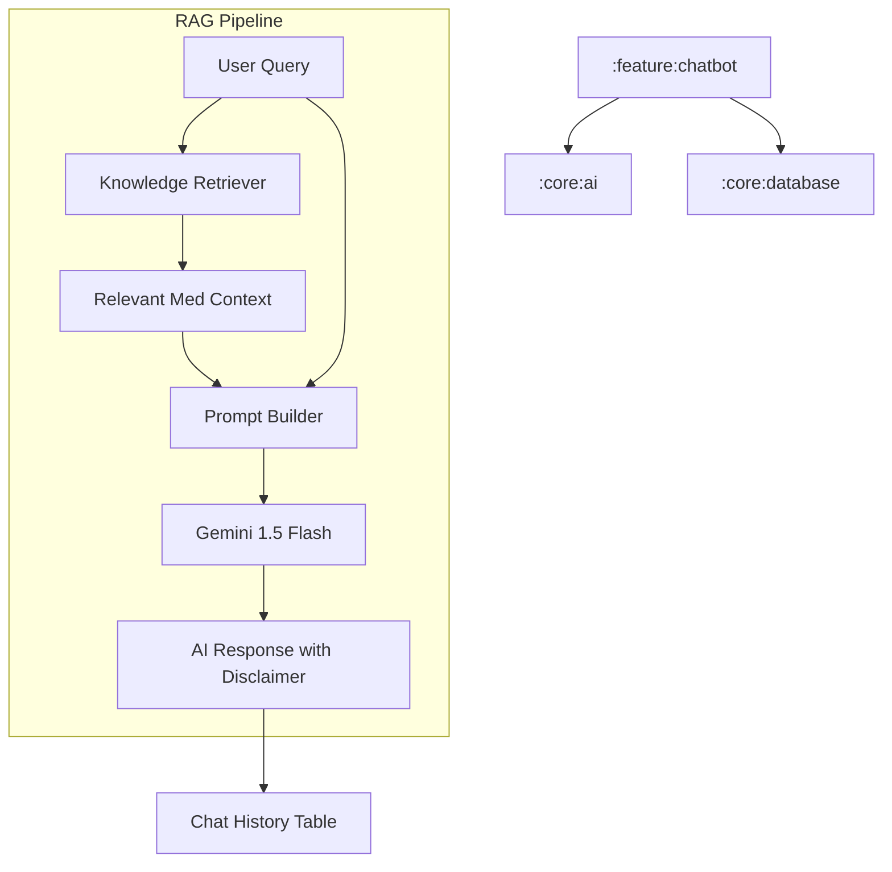

# Implementation Plan - Phase 12: AI Medical Chatbot (RAG)

Implement an enterprise-grade medical assistant using **Retrieval-Augmented Generation (RAG)** to provide accurate, context-aware answers based on medical knowledge bases.

## User Review Required

> [!IMPORTANT]
> This phase introduces conversational AI with local context injection.
>
> - **RAG Architecture**: We will simulate a Retrieval-Augmented Generation flow by injecting relevant "Knowledge Base" snippets (WHO guidelines, hospital policies) into the Gemini prompt based on user query keywords.
> - **Privacy & Safety**: Every response will include a mandatory medical disclaimer.
> - **Conversation Memory**: The chatbot will maintain context within a session but will also support persistence in Room for historical review.

## Proposed Changes

### Feature Chatbot (`:feature:chatbot`) [NEW MODULE]

#### [NEW] [Feature Chatbot Module Setup](file:///J:/Android/AndroidStudioProjects/Gemini/Ai-HealthCare-App/feature/chatbot)
- Create `:feature:chatbot` module using convention plugins.

#### [NEW] [Domain Layer](file:///J:/Android/AndroidStudioProjects/Gemini/Ai-HealthCare-App/feature/chatbot/src/main/kotlin/com/mediai/enterprise/feature/chatbot/domain)
- **ChatMessage** model: ID, Content, Role (User/Assistant), Timestamp.
- **SendMessageUseCase**: Orchestrates retrieval and LLM calling.

#### [NEW] [Data Layer](file:///J:/Android/AndroidStudioProjects/Gemini/Ai-HealthCare-App/feature/chatbot/src/main/kotlin/com/mediai/enterprise/feature/chatbot/data)
- **KnowledgeBaseProvider**: A repository of medical facts and hospital policies used for context injection.
- **ChatRepository**: Manages chat history in Room and communicates with Gemini.

#### [NEW] [UI Layer - Screens](file:///J:/Android/AndroidStudioProjects/Gemini/Ai-HealthCare-App/feature/chatbot/src/main/kotlin/com/mediai/enterprise/feature/chatbot/presentation)
- **ChatScreen**: A fluid message-based UI with typing indicators and quick-reply suggestions.
- **ChatViewModel**: Handles the UDF (Unidirectional Data Flow) for the conversation.

### Core Database (`:core:database`)

#### [NEW] [ChatMessageEntity.kt](file:///J:/Android/AndroidStudioProjects/Gemini/Ai-HealthCare-App/core/database/src/main/kotlin/com/mediai/enterprise/core/database/entity/ChatMessageEntity.kt)
- Persist chat messages for session recovery and history.

### Navigation (`:core:navigation`)

#### [MODIFY] [MediAINavDestinations.kt](file:///J:/Android/AndroidStudioProjects/Gemini/Ai-HealthCare-App/core/navigation/src/main/kotlin/com/mediai/enterprise/core/navigation/MediAINavDestinations.kt)
- Add `CHAT_ROUTE`.

## Architecture Diagram

## Verification Plan

### Automated Tests
- **Unit Tests**: Verify the context injection logic (ensure correct knowledge snippets are selected for specific keywords).
- **ViewModel Tests**: Verify message list updates and loading states.

### Manual Verification
- Ask the chatbot about "Hospital Visiting Hours" (Policy retrieval).
- Ask about "Diabetes symptoms" (Medical knowledge retrieval).
- Verify that the medical disclaimer is present in every AI response.
