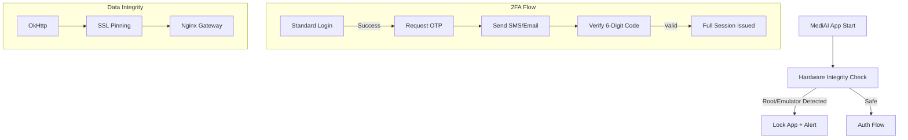

# Implementation Plan - Phase 35: Advanced Identity, 2FA & Hardware Integrity

Harden the **MediAI Enterprise** security posture by implementing multi-factor authentication and anti-tamper mechanisms to protect sensitive healthcare data.

## User Review Required

> [!CAUTION]
> This phase introduces "Anti-Tamper" logic that may restrict app execution on certain development environments.
>
> - **Environment Restrictions**: Root and Emulator detection will be configurable. In production, the app will refuse to run on compromised devices.
> - **SSL Pinning**: This ensures the app only talks to our Nginx gateway. If the certificate changes on the server, the app must be updated or it will lose connectivity.
> - **2FA logic**: We will implement the backend and frontend flow for **OTP (One-Time Password)** verification via Email/SMS.

## Proposed Changes

### Core Security (`:core:security`)

#### [NEW] [HardwareIntegrity.kt](file:///J:/Android/AndroidStudioProjects/Gemini/Ai-HealthCare-App/core/security/src/main/kotlin/com/mediai/enterprise/core/security/HardwareIntegrity.kt)
- Logic to detect Root access (checking for su binaries, test-keys).
- Logic to detect Emulator environments (checking build properties).
- Tamper detection (verifying app signature at runtime).

#### [NEW] [SslPinning.kt](file:///J:/Android/AndroidStudioProjects/Gemini/Ai-HealthCare-App/core/security/src/main/kotlin/com/mediai/enterprise/core/security/SslPinning.kt)
- Configuration for OkHttp `CertificatePinner`.

### Core Data (`:core:data`)

#### [NEW] [Proto DataStore Setup](file:///J:/Android/AndroidStudioProjects/Gemini/Ai-HealthCare-App/core/data/src/main/proto/user_prefs.proto)
- Define a protobuf schema for user settings (Language, Notification toggles, Theme).

#### [NEW] [UserPreferencesSerializer.kt](file:///J:/Android/AndroidStudioProjects/Gemini/Ai-HealthCare-App/core/data/src/main/kotlin/com/mediai/enterprise/core/data/prefs/UserPreferencesSerializer.kt)
- Implementation of the DataStore Serializer.

### Feature Authentication (`:feature:auth`)

#### [NEW] [OtpVerificationScreen.kt](file:///J:/Android/AndroidStudioProjects/Gemini/Ai-HealthCare-App/feature/auth/src/main/kotlin/com/mediai/enterprise/feature/auth/presentation/otp/OtpVerificationScreen.kt)
- 6-digit input UI for 2FA.
- Resend timer and error handling.

### Backend Updates (`backend/app`)

#### [NEW] [OTP Service](file:///J:/Android/AndroidStudioProjects/Gemini/Ai-HealthCare-App/backend/app/services/otp_service.py)
- Generate, store (in Redis), and verify 6-digit codes.

#### [MODIFY] [auth.py](file:///J:/Android/AndroidStudioProjects/Gemini/Ai-HealthCare-App/backend/app/api/v1/endpoints/auth.py)
- Add `/request-otp` and `/verify-otp` endpoints.

## Security Architecture

## Verification Plan

### Automated Tests
- **Unit Tests**: Verify that the OTP verification logic handles expired codes correctly in Redis.
- **Unit Tests**: Verify Proto DataStore read/write operations.

### Manual Verification
- Attempt to run the app on a rooted emulator and verify the "Environment Compromised" warning appears.
- Test the full 2FA login flow: Password -> OTP -> Dashboard.
- Verify that SSL Pinning blocks traffic if pointed to an invalid certificate.
