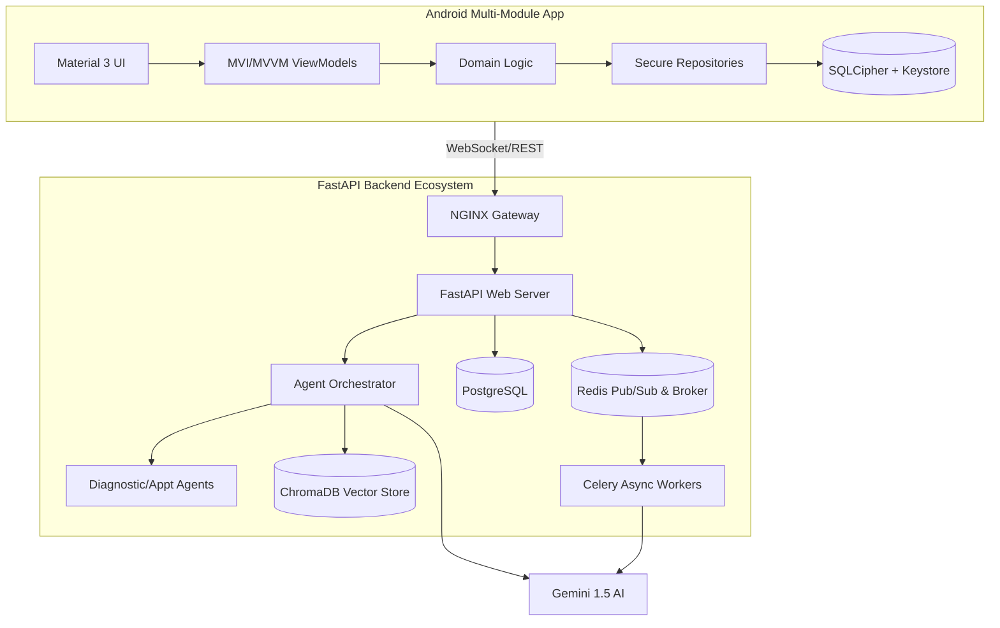

# Implementation Plan - Phase 34: Final Enterprise Polish & Handoff

Finalize the **MediAI Enterprise** platform by conducting a rigorous quality audit, elevating all technical documentation to a world-class standard, and preparing the final project showcase.

## User Review Required

> [!IMPORTANT]
> This is the official completion phase of the project.
>
> - **Final Audit**: We will conduct a "Principal Architect" level review of both the Android (20+ modules) and Backend ecosystems.
> - **Comprehensive Showcase**: We will create a final `PROJECT_SHOWCASE.md` that highlights every major technical accomplishment (RAG, Agents, OCR, SQLCipher, K8s).
> - **Asset Verification**: We will ensure all internal links and Mermaid diagrams are consistent across the entire `docs/` library.

## Proposed Changes

### Documentation Elevation (`docs/`)

#### [NEW] [PROJECT_SHOWCASE.md](file:///J:/Android/AndroidStudioProjects/Gemini/Ai-HealthCare-App/docs/PROJECT_SHOWCASE.md)
- A high-impact summary of the platform's capabilities.
- Technical "flex" section detailing the most complex engineering challenges solved.

#### [MODIFY] [ARCHITECTURE_GUIDE.md](file:///J:/Android/AndroidStudioProjects/Gemini/Ai-HealthCare-App/docs/ARCHITECTURE_GUIDE.md)
- Finalize the full system interaction diagram (Mobile <-> Nginx <-> FastAPI <-> DB/AI).

#### [MODIFY] [AI_GUIDE.md](file:///J:/Android/AndroidStudioProjects/Gemini/Ai-HealthCare-App/docs/AI_GUIDE.md)
- Deep dive into the "Agentic Orchestration" logic and how Gemini 1.5 powers the autonomous tool selection.

### Codebase Finalization

#### [MODIFY] [Backend & Android (Project-wide)]
- Perform a final KDoc/Docstring sweep to ensure 100% descriptive coverage.
- Remove any leftover debug logs or temporary commented-out code.
- Verify that all environment variables are correctly documented in `config.py` and `local.properties`.

### Infrastructure Polish

#### [MODIFY] [docker-compose.yml](file:///J:/Android/AndroidStudioProjects/Gemini/Ai-HealthCare-App/docker-compose.yml)
- Finalize resource limits and health checks for all containers.

### Project README

#### [MODIFY] [README.md](file:///J:/Android/AndroidStudioProjects/Gemini/Ai-HealthCare-App/README.md)
- Final update with the full multi-module dependency graph and a "Getting Started" guide for new contributors.

## Full System Architecture (Final)

## Verification Plan

### Technical Audit
- Run `./gradlew check` (Android) and `pytest` (Backend) one final time.
- Verify that every module in the project follows the Clean Architecture boundaries.

### Final Build
- Verify that `gradlew assembleRelease` and `docker-compose build` both succeed without errors.
- Ensure the Nginx rate-limiting and security headers are correctly applied.
