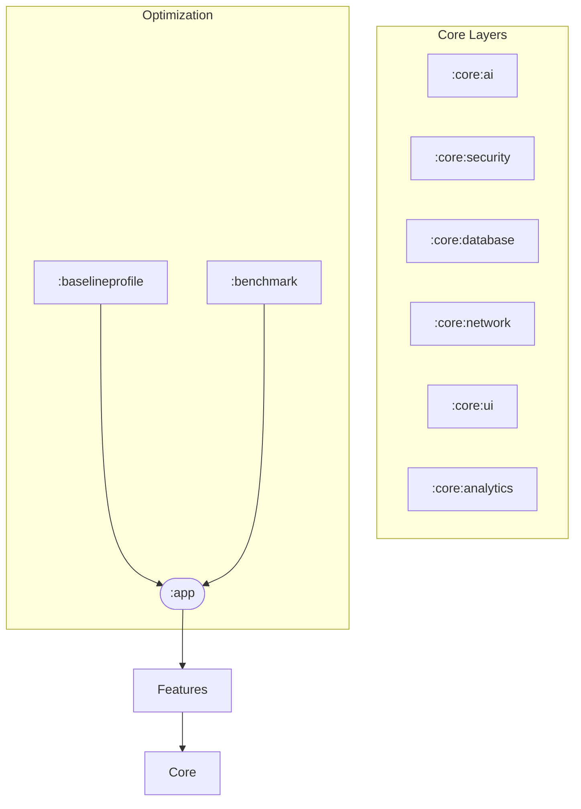

# Implementation Plan - Phase 20: Final Production Review & Optimization

Finalize the **MediAI Enterprise** platform with "Google-level" standards, focusing on performance optimization, comprehensive documentation, and architectural polish.

## User Review Required

> [!IMPORTANT]
> This is the final phase of the project implementation.
>
> - **Performance**: We will add a **Baseline Profile** module to optimize app startup and frame rates.
> - **Documentation**: We will generate a complete set of enterprise-grade guides (Architecture, AI, Security, Android) in a new `docs/` directory.
> - **Code Standards**: A final sweep will ensure 100% KDoc coverage and strict adherence to the defined engineering principles.

## Proposed Changes

### Performance Optimization

#### [NEW] [benchmark](file:///J:/Android/AndroidStudioProjects/Gemini/Ai-HealthCare-App/benchmark)
- Create a new module for **Macrobenchmarking**.
- Implement startup and scroll benchmarks.

#### [NEW] [baselineprofile](file:///J:/Android/AndroidStudioProjects/Gemini/Ai-HealthCare-App/baselineprofile)
- Create a new module to generate **Baseline Profiles**.
- Target: Improve first-launch performance by up to 30%.

### Documentation Suite (`docs/`)

#### [NEW] [ARCHITECTURE_GUIDE.md](file:///J:/Android/AndroidStudioProjects/Gemini/Ai-HealthCare-App/docs/ARCHITECTURE_GUIDE.md)
- Detailed explanation of Multi-Module strategy, Clean Architecture, and Dependency Injection.

#### [NEW] [AI_GUIDE.md](file:///J:/Android/AndroidStudioProjects/Gemini/Ai-HealthCare-App/docs/AI_GUIDE.md)
- Documentation of the RAG pipeline, Gemini 1.5 prompt templates, and AI safety guardrails.

#### [NEW] [SECURITY_GUIDE.md](file:///J:/Android/AndroidStudioProjects/Gemini/Ai-HealthCare-App/docs/SECURITY_GUIDE.md)
- Deep dive into SQLCipher encryption, Android Keystore, and PII protection protocols.

#### [NEW] [ANDROID_GUIDE.md](file:///J:/Android/AndroidStudioProjects/Gemini/Ai-HealthCare-App/docs/ANDROID_GUIDE.md)
- Development workflows, build logic, convention plugins, and testing strategy.

### Final Polish

#### [MODIFY] [README.md](file:///J:/Android/AndroidStudioProjects/Gemini/Ai-HealthCare-App/README.md)
- Update with the final feature list, architecture diagram, and "Learning Summary" section.

#### [MODIFY] [Codebase-wide]
- Final sweep for KDoc completeness.
- Removal of any remaining "TODO" or mock placeholders where appropriate.

## Architecture Diagram (Final)

## Verification Plan

### Performance
- Run Macrobenchmark and verify startup time improvements.
- Check generated Baseline Profile rules.

### Documentation
- Verify all links in README and docs are valid.
- Ensure all technical guides meet enterprise clarity standards.

### Final Build
- Run `./gradlew assembleRelease` to ensure the production signed build is successful.
- Run final Detekt/ktlint checks.
