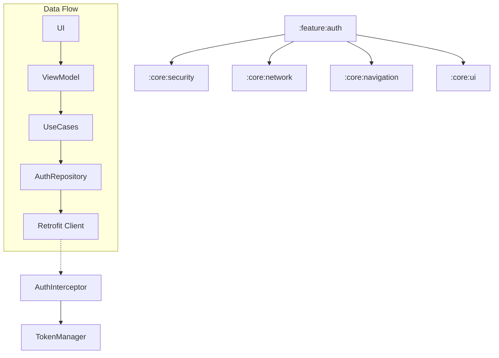

# Implementation Plan - Phase 5: Authentication

Implement a secure, enterprise-grade authentication system for **MediAI Enterprise**, including JWT management, biometric login, and a modularized UI.

## User Review Required

> [!IMPORTANT]
> This phase introduces critical security features.
>
> - **Biometric Integration**: We will support Fingerprint and Face Unlock using the Android Biometric API.
> - **Secure Token Storage**: JWT tokens will be stored in `EncryptedSharedPreferences` within `:core:security`.
> - **JWT Management**: Automatic token injection and refresh logic in `:core:network`.
> - **Modular UI**: All authentication screens will reside in the new `:feature:auth` module.

## Proposed Changes

### Core Security (`:core:security`)

#### [MODIFY] [libs.versions.toml](file:///J:/Android/AndroidStudioProjects/Gemini/Ai-HealthCare-App/gradle/libs.versions.toml)
- Add `androidx.biometric` and `androidx.security-crypto` dependencies.

#### [NEW] [TokenManager.kt](file:///J:/Android/AndroidStudioProjects/Gemini/Ai-HealthCare-App/core/security/src/main/kotlin/com/mediai/enterprise/core/security/TokenManager.kt)
- Manage JWT and Refresh tokens using `EncryptedSharedPreferences`.

#### [NEW] [BiometricAuthenticator.kt](file:///J:/Android/AndroidStudioProjects/Gemini/Ai-HealthCare-App/core/security/src/main/kotlin/com/mediai/enterprise/core/security/BiometricAuthenticator.kt)
- Helper class for biometric authentication requests.

### Core Network (`:core:network`)

#### [NEW] [AuthInterceptor.kt](file:///J:/Android/AndroidStudioProjects/Gemini/Ai-HealthCare-App/core/network/src/main/kotlin/com/mediai/enterprise/core/network/AuthInterceptor.kt)
- Intercepts outgoing requests to add the `Authorization: Bearer <token>` header.

#### [NEW] [TokenAuthenticator.kt](file:///J:/Android/AndroidStudioProjects/Gemini/Ai-HealthCare-App/core/network/src/main/kotlin/com/mediai/enterprise/core/network/TokenAuthenticator.kt)
- Automatically handles `401 Unauthorized` by attempting a token refresh.

### Feature Authentication (`:feature:auth`) [NEW MODULE]

#### [NEW] [Feature Auth Module Setup](file:///J:/Android/AndroidStudioProjects/Gemini/Ai-HealthCare-App/feature/auth)
- Create `:feature:auth` module using the `mediai.android.library`, `mediai.android.compose`, and `mediai.android.hilt` convention plugins.

#### [NEW] [Domain Layer](file:///J:/Android/AndroidStudioProjects/Gemini/Ai-HealthCare-App/feature/auth/src/main/kotlin/com/mediai/enterprise/feature/auth/domain)
- Define `AuthRepository` interface.
- Implement `LoginUseCase`, `RegisterUseCase`, and `ValidateOtpUseCase`.

#### [NEW] [Data Layer](file:///J:/Android/AndroidStudioProjects/Gemini/Ai-HealthCare-App/feature/auth/src/main/kotlin/com/mediai/enterprise/feature/auth/data)
- Implement `AuthRepositoryImpl` using `AuthApiService`.
- Define `AuthApiService` for backend communication.

#### [NEW] [UI Layer](file:///J:/Android/AndroidStudioProjects/Gemini/Ai-HealthCare-App/feature/auth/src/main/kotlin/com/mediai/enterprise/feature/auth/presentation)
- **LoginScreen**: Input fields for email/password and Biometric login button.
- **RegisterScreen**: User onboarding flow.
- **OtpScreen**: For 2FA/OTP verification.
- **AuthViewModel**: State management for the auth flow.

### Navigation (`:core:navigation`)

#### [NEW] [AuthNavigation.kt](file:///J:/Android/AndroidStudioProjects/Gemini/Ai-HealthCare-App/core/navigation/src/main/kotlin/com/mediai/enterprise/core/navigation/AuthNavigation.kt)
- Define navigation routes and graphs for the authentication feature.

## Architecture Diagram

## Verification Plan

### Automated Tests
- **Unit Tests**: Test `LoginUseCase` with mocked repository.
- **Unit Tests**: Test `AuthInterceptor` and `TokenAuthenticator`.
- **ViewModel Tests**: Test state transitions during login.

### Manual Verification
- Verify successful login with mock credentials.
- Test biometric prompt on supported devices/emulators.
- Check `EncryptedSharedPreferences` using Android Studio's Device File Explorer.
