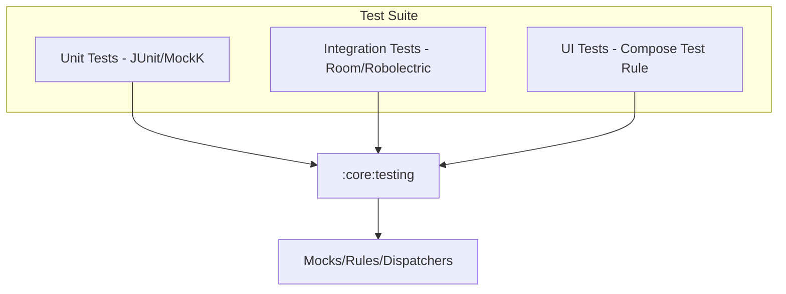

# Implementation Plan - Phase 17: Testing & Quality Assurance

Establish a comprehensive testing ecosystem for **MediAI Enterprise**, ensuring high reliability, performance, and code quality across all layers.

## User Review Required

> [!IMPORTANT]
> This phase establishes the "Truth" for the application's behavior.
>
> - **Test Strategy**: We will adopt the Testing Pyramid: 70% Unit Tests, 20% Integration Tests, 10% UI Tests.
> - **Architecture**: We will utilize the `:core:testing` module to provide shared test utilities, mock data providers, and custom JUnit rules.
> - **Mocking**: We will use **MockK** for unit tests and **Turbine** for testing Kotlin Flows.

## Proposed Changes

### Core Testing (`:core:testing`)

#### [NEW] [MainDispatcherRule.kt](file:///J:/Android/AndroidStudioProjects/Gemini/Ai-HealthCare-App/core/testing/src/main/kotlin/com/mediai/enterprise/core/testing/rules/MainDispatcherRule.kt)
- JUnit rule to swap the Main dispatcher with a TestDispatcher for coroutine testing.

#### [NEW] [TestData.kt](file:///J:/Android/AndroidStudioProjects/Gemini/Ai-HealthCare-App/core/testing/src/main/kotlin/com/mediai/enterprise/core/testing/data/TestData.kt)
- Standardized mock objects for Users, Reports, Appointments, and Vitals.

### Unit Testing

#### [NEW] [LoginUseCaseTest.kt](file:///J:/Android/AndroidStudioProjects/Gemini/Ai-HealthCare-App/feature/auth/src/test/kotlin/com/mediai/enterprise/feature/auth/domain/usecase/LoginUseCaseTest.kt)
- Verify authentication logic, input validation, and error handling.

#### [NEW] [HomeViewModelTest.kt](file:///J:/Android/AndroidStudioProjects/Gemini/Ai-HealthCare-App/feature/home/src/test/kotlin/com/mediai/enterprise/feature/home/presentation/HomeViewModelTest.kt)
- Verify state transitions and data loading flows in the dashboard.

### Integration Testing

#### [NEW] [MedicineDaoTest.kt](file:///J:/Android/AndroidStudioProjects/Gemini/Ai-HealthCare-App/core/database/src/androidTest/kotlin/com/mediai/enterprise/core/database/dao/MedicineDaoTest.kt)
- Verify Room database operations (Insert, Query, Delete) using an in-memory database.

### UI / Compose Testing

#### [NEW] [LoginScreenTest.kt](file:///J:/Android/AndroidStudioProjects/Gemini/Ai-HealthCare-App/feature/auth/src/androidTest/kotlin/com/mediai/enterprise/feature/auth/presentation/login/LoginScreenTest.kt)
- Verify UI interactions (text entry, button clicks) and error visibility.

### Quality Assurance

#### [MODIFY] [build.gradle.kts (root)](file:///J:/Android/AndroidStudioProjects/Gemini/Ai-HealthCare-App/build.gradle.kts)
- Configure **Jacoco** for code coverage reporting.

## Architecture Diagram

## Verification Plan

### Automated Tests
- Run `./gradlew test` to execute all unit tests.
- Run `./gradlew connectedAndroidTest` to execute integration and UI tests on an emulator.

### Coverage
- Generate a Jacoco report and verify that business logic (UseCases/ViewModels) has >90% coverage.
