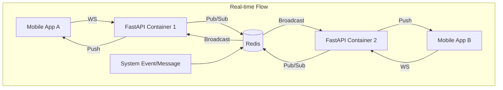

# Implementation Plan - Phase 33: Multi-Device Sync & Real-time Events

Implement real-time synchronization and event broadcasting for **MediAI Enterprise** using **WebSockets** and **Redis Pub/Sub**.

## User Review Required

> [!IMPORTANT]
> This phase moves the app from a "pull-based" to a "push-based" real-time system.
>
> - **WebSocket Infrastructure**: We will implement a persistent connection between the mobile app and backend to handle real-time chat messages and system alerts.
> - **Redis Pub/Sub**: Used on the backend to ensure that if a user has multiple devices (or multiple backend containers are running), the events are broadcasted correctly to the relevant WebSocket connections.
> - **Real-time Chat**: Messages will no longer require a refresh or a new POST request to be seen; they will appear instantly in the UI.

## Proposed Changes

### Backend Infrastructure (`backend/app/core`)

#### [NEW] [websockets.py](file:///J:/Android/AndroidStudioProjects/Gemini/Ai-HealthCare-App/backend/app/core/websockets.py)
- Implement a `ConnectionManager` to handle active WebSocket connections.
- Logic to associate `user_id` with specific WebSocket sessions.

#### [MODIFY] [celery_app.py](file:///J:/Android/AndroidStudioProjects/Gemini/Ai-HealthCare-App/backend/app/core/celery_app.py)
- Integrate Redis as a Pub/Sub layer for event broadcasting.

### API Endpoints (`backend/app/api/v1/endpoints`)

#### [NEW] [ws.py](file:///J:/Android/AndroidStudioProjects/Gemini/Ai-HealthCare-App/backend/app/api/v1/endpoints/ws.py)
- `WS /connect`: The main WebSocket entry point for the mobile app.
- Handles authentication via token in the query parameter.

### Android Application (`:core:network`)

#### [NEW] [MediAIWebSocketClient.kt](file:///J:/Android/AndroidStudioProjects/Gemini/Ai-HealthCare-App/core/network/src/main/kotlin/com/mediai/enterprise/core/network/websocket/MediAIWebSocketClient.kt)
- Use **OkHttp WebSocket** to maintain a persistent connection.
- Implement automatic reconnection logic and heartbeat (ping/pong).

#### [NEW] [RealtimeEvent.kt](file:///J:/Android/AndroidStudioProjects/Gemini/Ai-HealthCare-App/core/network/src/main/kotlin/com/mediai/enterprise/core/network/websocket/RealtimeEvent.kt)
- Define a sealed class for events: `ChatMessageReceived`, `AppointmentStatusChanged`, `EmergencyAlertTriggered`.

### Feature Integration (`:feature:chatbot`)

#### [MODIFY] [ChatViewModel.kt](file:///J:/Android/AndroidStudioProjects/Gemini/Ai-HealthCare-App/feature/chatbot/src/main/kotlin/com/mediai/enterprise/feature/chatbot/presentation/chat/ChatViewModel.kt)
- Subscribe to the WebSocket event stream to update the UI in real-time.

## Architecture Diagram

## Verification Plan

### Automated Tests
- **Backend Tests**: Verify that sending a message to Redis Pub/Sub correctly pushes data to an active WebSocket connection.
- **Android Tests**: Verify the WebSocket client handles connection drops and reconnections gracefully.

### Manual Verification
- Open the app on two different emulators with the same user account.
- Send a chat message from one and verify it appears instantly on the other without refreshing.
- Trigger an appointment status change on the backend and verify the mobile UI updates immediately.
