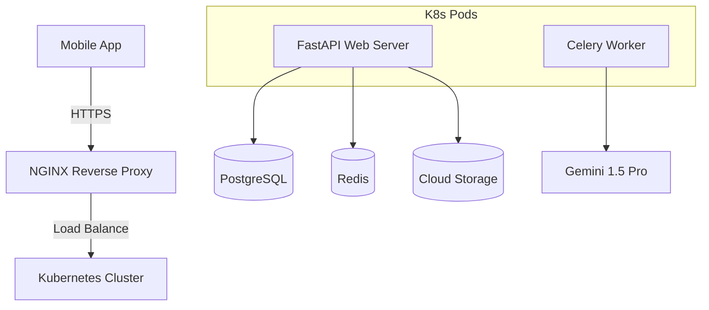

# Implementation Plan - Phase 28: Production DevOps & Backend Hardening

Finalize the **MediAI Enterprise** backend with enterprise-grade infrastructure, automated migrations, and rigorous quality assurance.

## User Review Required

> [!IMPORTANT]
> This phase establishes the "Production-Ready" status of the server-side ecosystem.
>
> - **Schema Versioning**: We will use **Alembic** to ensure database changes are trackable and reversible.
> - **Orchestration**: We will move beyond Docker Compose to **Kubernetes** manifests for scalable deployments.
> - **Edge Security**: **NGINX** will be introduced as a gateway to handle rate limiting and secure headers.
> - **File Integrity**: Reports will now be handled via a Cloud Storage service (simulated via MinIO or AWS S3 SDK).

## Proposed Changes

### Database Versioning (`backend/app/db`)

#### [NEW] [Alembic Configuration](file:///J:/Android/AndroidStudioProjects/Gemini/Ai-HealthCare-App/backend/alembic.ini)
- Initialize Alembic for the project.
- Create the first migration script that matches our SQLAlchemy models.

### Backend Testing Suite (`backend/tests`)

#### [NEW] [conftest.py](file:///J:/Android/AndroidStudioProjects/Gemini/Ai-HealthCare-App/backend/tests/conftest.py)
- Setup a test database and a clean environment for every test run.

#### [NEW] [Test Cases](file:///J:/Android/AndroidStudioProjects/Gemini/Ai-HealthCare-App/backend/tests/)
- `test_auth.py`: Verify registration and JWT validation.
- `test_agents.py`: Verify orchestrator routing and tool execution.

### Infrastructure & Orchestration (`/`)

#### [NEW] [nginx.conf](file:///J:/Android/AndroidStudioProjects/Gemini/Ai-HealthCare-App/infra/nginx/nginx.conf)
- Configure Nginx as a reverse proxy for the FastAPI app.
- Implement rate limiting to prevent API abuse.

#### [NEW] [Kubernetes Manifests](file:///J:/Android/AndroidStudioProjects/Gemini/Ai-HealthCare-App/infra/k8s/)
- `deployment.yaml`: Define replicas, resource limits, and environment variables.
- `service.yaml`: Configure LoadBalancer/ClusterIP access.

### CI/CD Integration

#### [NEW] [backend-ci.yml](file:///J:/Android/AndroidStudioProjects/Gemini/Ai-HealthCare-App/.github/workflows/backend-ci.yml)
- GitHub Actions workflow to run **Pytest** and build the Docker image for the backend.

## Production Architecture Diagram

## Verification Plan

### Automated Tests
- Run `pytest` and ensure 100% pass rate for core services.
- Run `alembic check` to verify migration consistency.

### Manual Verification
- Deploy the ecosystem using `docker-compose` and verify Nginx correctly proxies traffic to the FastAPI server.
- Verify that rate limiting triggers after multiple rapid requests to the same endpoint.
