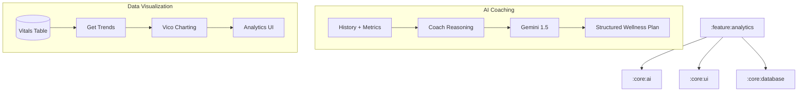

# Implementation Plan - Phase 15: AI Health Coach & Analytics

Implement personalized wellness planning and interactive health data visualization for **MediAI Enterprise**.

## User Review Required

> [!IMPORTANT]
> This phase focuses on long-term health management and data-driven insights.
>
> - **AI Coaching**: We will use Gemini to generate personalized "Wellness Blueprints" (Diet, Exercise, Sleep, Stress) based on the user's health timeline and metrics.
> - **Data Visualization**: We will integrate the **Vico** charting library to create interactive Line and Bar charts for health trends.
> - **New Module**: Creating `:feature:analytics` to house the coaching and data visualization screens.

## Proposed Changes

### Build Configuration

#### [MODIFY] [libs.versions.toml](file:///J:/Android/AndroidStudioProjects/Gemini/Ai-HealthCare-App/gradle/libs.versions.toml)
- Add **Vico** (Compose charting library) dependencies.

### Core AI (`:core:ai`)

#### [NEW] [HealthCoachAi.kt](file:///J:/Android/AndroidStudioProjects/Gemini/Ai-HealthCare-App/core/ai/src/main/kotlin/com/mediai/enterprise/core/ai/HealthCoachAi.kt)
- Specialized service to generate personalized wellness plans using **Gemini 1.5**.
- Plans include: Daily Goals, Nutritional Focus, Exercise Routine, and Mental Health tips.

### Feature Analytics (`:feature:analytics`) [NEW MODULE]

#### [NEW] [Feature Analytics Module Setup](file:///J:/Android/AndroidStudioProjects/Gemini/Ai-HealthCare-App/feature/analytics)
- Create `:feature:analytics` module using convention plugins.

#### [NEW] [Domain Layer](file:///J:/Android/AndroidStudioProjects/Gemini/Ai-HealthCare-App/feature/analytics/src/main/kotlin/com/mediai/enterprise/feature/analytics/domain)
- **WellnessPlan** model: Daily/Weekly objectives for different health pillars.
- **HealthTrend** model: Data points for charting (e.g., Steps over time, Weight trend).
- UseCases: `GetWellnessPlanUseCase`, `GetHealthTrendsUseCase`.

#### [NEW] [UI Layer - Screens](file:///J:/Android/AndroidStudioProjects/Gemini/Ai-HealthCare-App/feature/analytics/src/main/kotlin/com/mediai/enterprise/feature/analytics/presentation)
- **HealthCoachScreen**: Displaying the AI-generated wellness plan with interactive goal tracking.
- **AnalyticsDashboardScreen**: Interactive charts for various health metrics.

#### [NEW] [UI Layer - Components](file:///J:/Android/AndroidStudioProjects/Gemini/Ai-HealthCare-App/feature/analytics/src/main/kotlin/com/mediai/enterprise/feature/analytics/presentation/components)
- **TrendChart**: Reusable Vico-based chart component for Line and Bar graphs.
- **WellnessGoalCard**: Checkable item for the daily AI-prescribed goals.

### Navigation (`:core:navigation`)

#### [MODIFY] [MediAINavDestinations.kt](file:///J:/Android/AndroidStudioProjects/Gemini/Ai-HealthCare-App/core/navigation/src/main/kotlin/com/mediai/enterprise/core/navigation/MediAINavDestinations.kt)
- Add `HEALTH_COACH_ROUTE` and `ANALYTICS_DASHBOARD_ROUTE`.

## Architecture Diagram

## Verification Plan

### Automated Tests
- **Unit Tests**: Verify the parsing of the AI-generated wellness plan.
- **Unit Tests**: Verify the data transformation logic for Vico charts.

### Manual Verification
- Verify that the charts correctly display historical data (mocked for now).
- Check the responsiveness of the Health Coach screen on different devices.
- Ensure the AI coach takes recent "Emergency" or "High Risk" events into account.
