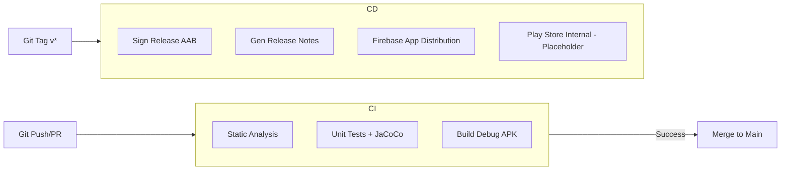

# Implementation Plan - Phase 18: CI/CD & Deployment

Automate the full software development lifecycle for **MediAI Enterprise**, from code verification to automated distribution.

## User Review Required

> [!IMPORTANT]
> This phase establishes the automated delivery pipeline.
>
> - **GitHub Actions**: We will implement a multi-stage pipeline: `Verify` (Lint/Test) -> `Build` (APK/AAB) -> `Distribute` (Firebase).
> - **Secrets Management**: Deployment requires sensitive keys (Keystore, Firebase App ID, Service Account JSON). These will be managed via GitHub Secrets.
> - **Firebase App Distribution**: We will automate internal testing releases.

## Proposed Changes

### CI/CD Pipelines (`.github/workflows/`)

#### [MODIFY] [android.yml](file:///J:/Android/AndroidStudioProjects/Gemini/Ai-HealthCare-App/.github/workflows/android.yml)
- Refactor into a multi-job workflow:
    - **Lint Job**: Runs Detekt and ktlint in parallel.
    - **Test Job**: Runs all unit tests and generates JaCoCo coverage reports.
    - **Build Job**: Compiles the debug APK and release AAB.

#### [NEW] [release.yml](file:///J:/Android/AndroidStudioProjects/Gemini/Ai-HealthCare-App/.github/workflows/release.yml)
- A dedicated workflow triggered by Git Tags (`v*.*.*`).
- Features:
    - Automated Semantic Versioning.
    - Release Notes generation using `conventional-changelog`.
    - Artifact signing (using placeholder secrets).
    - **Firebase App Distribution**: Upload the APK to testers automatically.

### Release Automation Scripts

#### [NEW] [versioning.sh](file:///J:/Android/AndroidStudioProjects/Gemini/Ai-HealthCare-App/scripts/versioning.sh)
- Script to bump versions based on commit history (feat/fix/chore).

### Build Logic Updates

#### [MODIFY] [AndroidApplicationConventionPlugin.kt](file:///J:/Android/AndroidStudioProjects/Gemini/Ai-HealthCare-App/build-logic/convention/src/main/kotlin/AndroidApplicationConventionPlugin.kt)
- Add signing configuration blocks for release builds.

## Pipeline Architecture

## Verification Plan

### Automated Tests
- Validate GitHub Actions YAML syntax.
- Simulate a workflow run using `act` (local CI runner) or by pushing to a branch.

### Manual Verification
- Verify that JaCoCo reports are correctly uploaded as workflow artifacts.
- Check that the "Release" workflow is triggered correctly by a tag.
- (Optional) Configure a test Firebase project to verify actual distribution.
