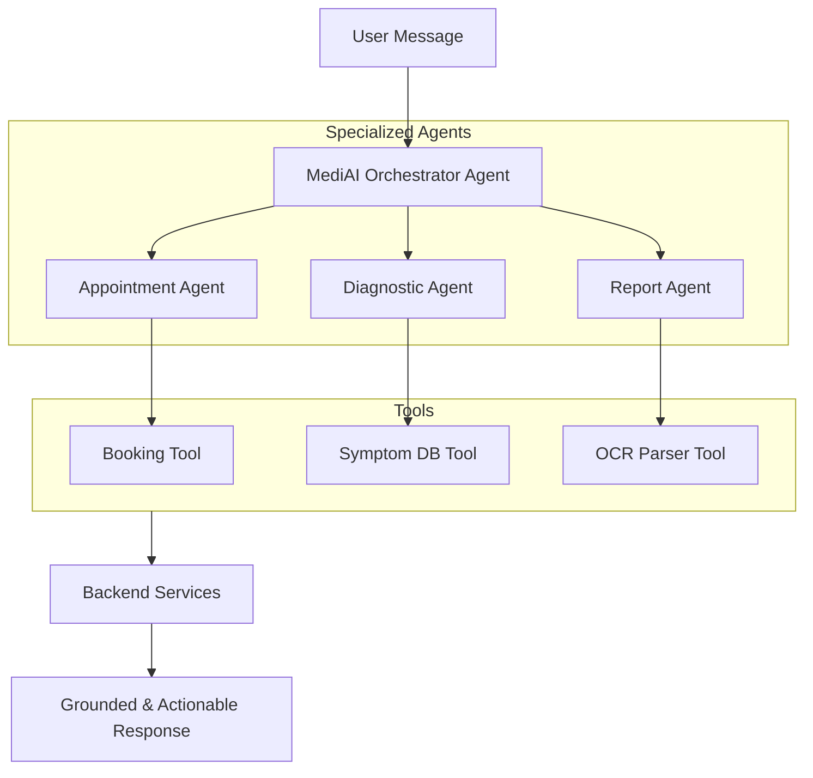

# Implementation Plan - Phase 27: specialized AI Agents & Evaluation Pipeline

Transform the backend AI from a simple request-response model into a system of **specialized AI Agents** with function-calling capabilities and a rigorous evaluation framework.

## User Review Required

> [!IMPORTANT]
> This phase implements the "Agentic" behavior requested in the project goals.
>
> - **AI Agents**: We will create dedicated agent definitions for `Medical Chat`, `Appointments`, `OCR`, and `Emergency`.
> - **Function Calling**: We will expose our backend services as "Tools" that Gemini can autonomously decide to use (e.g., the Chat Agent can decide to call the Appointment Tool to book a slot).
> - **Evaluation Pipeline**: We will implement a scoring system to evaluate AI responses for clinical accuracy, tone, and safety disclaimers.

## Proposed Changes

### AI Agent Framework (`backend/app/core/agents`)

#### [NEW] [base_agent.py](file:///J:/Android/AndroidStudioProjects/Gemini/Ai-HealthCare-App/backend/app/core/agents/base_agent.py)
- Define the `BaseAgent` class with role, memory, and tool integration.

#### [NEW] [medical_agents.py](file:///J:/Android/AndroidStudioProjects/Gemini/Ai-HealthCare-App/backend/app/core/agents/medical_agents.py)
- Implement specialized agents:
    - **Appointment Agent**: Specializes in scheduling and availability logic.
    - **Diagnostic Agent**: Handles symptom checking and urgency detection.
    - **Report Agent**: Focused on interpreting medical documents.

### Tooling & Function Calling (`backend/app/core/tools`)

#### [NEW] [medical_tools.py](file:///J:/Android/AndroidStudioProjects/Gemini/Ai-HealthCare-App/backend/app/core/tools/medical_tools.py)
- Expose Python functions to the AI:
    - `search_doctors_tool`
    - `get_user_health_history_tool`
    - `trigger_emergency_alert_tool`

### Evaluation Pipeline (`backend/app/core/eval`)

#### [NEW] [evaluator.py](file:///J:/Android/AndroidStudioProjects/Gemini/Ai-HealthCare-App/backend/app/core/eval/evaluator.py)
- A system to run a battery of test prompts and compare AI outputs against "Ground Truth" or safety benchmarks.

### API Integration

#### [MODIFY] [chat_service.py](file:///J:/Android/AndroidStudioProjects/Gemini/Ai-HealthCare-App/backend/app/services/chat_service.py)
- Update the chat flow to route requests through the **MediAI Orchestrator Agent**.

## Agent Architecture Diagram

## Verification Plan

### Automated Tests
- **Agent Logic Tests**: Verify that the orchestrator correctly routes "I want to see a doctor" to the Appointment Agent.
- **Function Calling Tests**: Ensure the AI correctly formats arguments for the backend tools.

### Manual Verification
- Test complex queries like "My head hurts, can you find me a doctor for tomorrow?" (Requires routing from Diagnostic -> Appointment).
- Run the Evaluation script and verify the "Accuracy Score" for common medical queries.
