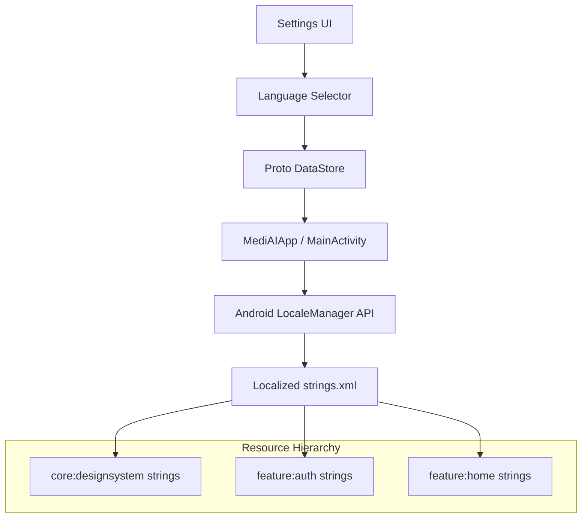

# Implementation Plan - Phase 37: Multi-Language Support & Internationalization

Implement a robust internationalization (i18n) framework for **MediAI Enterprise**, enabling global accessibility through multi-language support, locale-aware formatting, and Right-to-Left (RTL) compatibility.

## User Review Required

> [!IMPORTANT]
> This phase establishes the foundation for global reach.
>
> - **Language Management**: Users will be able to switch languages dynamically within the app settings.
> - **Multi-Module Strings**: We will adopt a "Core Strings" strategy for shared terms, while feature-specific strings remain in their respective modules.
> - **RTL Support**: We will ensure all layouts are compatible with Right-to-Left languages like Arabic.
> - **Persistence**: Language preferences will be stored in **Proto DataStore**.

## Proposed Changes

### Core UI (`:core:ui`)

#### [NEW] [LocaleHelper.kt](file:///J:/Android/AndroidStudioProjects/Gemini/Ai-HealthCare-App/core/ui/src/main/kotlin/com/mediai/enterprise/core/ui/util/LocaleHelper.kt)
- Utility to change the app's locale at runtime without a full activity recreation where possible.

### Core Design System (`:core:designsystem`)

#### [NEW] [Common Strings](file:///J:/Android/AndroidStudioProjects/Gemini/Ai-HealthCare-App/core/designsystem/src/main/res/values/strings.xml)
- Define standard healthcare terms (e.g., "Doctor", "Appointment", "Hospital") in English.

#### [NEW] [Spanish Translation](file:///J:/Android/AndroidStudioProjects/Gemini/Ai-HealthCare-App/core/designsystem/src/main/res/values-es/strings.xml)
- Provide translations for common terms.

#### [NEW] [Arabic Translation (RTL)](file:///J:/Android/AndroidStudioProjects/Gemini/Ai-HealthCare-App/core/designsystem/src/main/res/values-ar/strings.xml)
- Provide translations and verify layout mirroring.

### Feature Settings (`:feature:settings`) [NEW MODULE]

#### [NEW] [LanguageSelectionScreen.kt](file:///J:/Android/AndroidStudioProjects/Gemini/Ai-HealthCare-App/feature/settings/src/main/kotlin/com/mediai/enterprise/feature/settings/presentation/language/LanguageSelectionScreen.kt)
- A dedicated UI for users to choose their preferred language.

### Core Data (`:core:data`)

#### [MODIFY] [user_prefs.proto](file:///J:/Android/AndroidStudioProjects/Gemini/Ai-HealthCare-App/core/data/src/main/proto/user_prefs.proto)
- Ensure the `language` field is utilized and synchronized with the Android system configuration.

### Navigation (`:core:navigation`)

#### [MODIFY] [MediAINavDestinations.kt](file:///J:/Android/AndroidStudioProjects/Gemini/Ai-HealthCare-App/core/navigation/src/main/kotlin/com/mediai/enterprise/core/navigation/MediAINavDestinations.kt)
- Add `SETTINGS_ROUTE` and `LANGUAGE_SELECTION_ROUTE`.

## Architecture Diagram

## Verification Plan

### Automated Tests
- **Unit Tests**: Verify that updating the DataStore language correctly triggers the locale update logic.
- **Compose Previews**: Test `LanguageSelectionScreen` in different locales (EN, ES, AR) to verify RTL layout mirroring.

### Manual Verification
- Switch language to Spanish and verify the Dashboard metrics and labels update correctly.
- Switch language to Arabic and verify the entire UI mirrors (RTL) and text is correctly aligned.
- Restart the app and verify the language preference persists.
