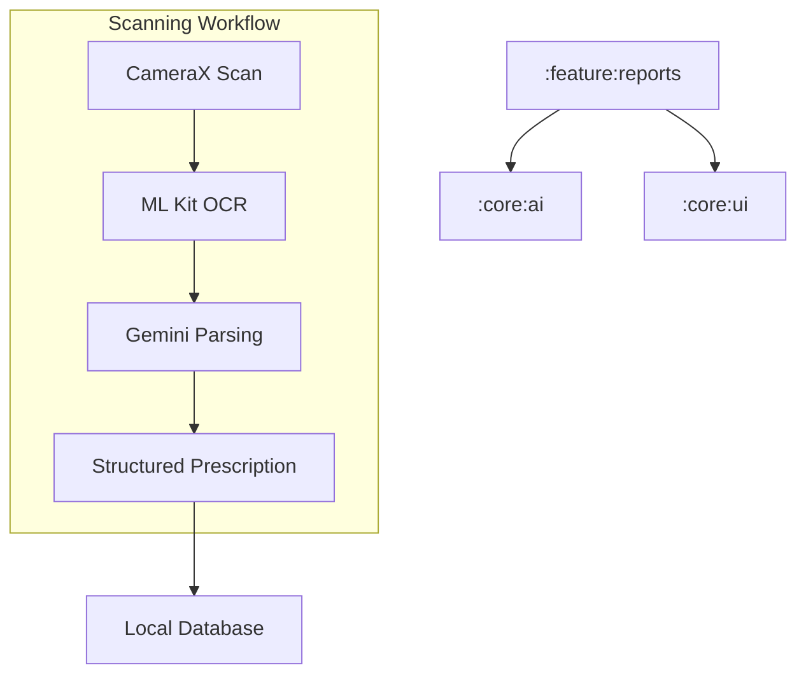

# Implementation Plan - Phase 8: Medical Reports & Prescription OCR

Implement the document management system for **MediAI Enterprise**, enabling users to upload, scan, and extract intelligent insights from medical reports and prescriptions.

## User Review Required

> [!IMPORTANT]
> This phase involves high-complexity integrations:
>
> - **CameraX & OCR**: Implementing a custom camera interface for high-quality document scanning and text extraction.
> - **Gemini Integration**: Using AI to parse raw OCR text into structured medical data (Doctor name, Medicines, Dosage).
> - **File Handling**: Managing PDF and Image URIs safely within the Android ecosystem.

## Proposed Changes

### Feature Reports (`:feature:reports`) [NEW MODULE]

#### [NEW] [Feature Reports Module Setup](file:///J:/Android/AndroidStudioProjects/Gemini/Ai-HealthCare-App/feature/reports)
- Create `:feature:reports` module using convention plugins.

#### [NEW] [Domain Layer](file:///J:/Android/AndroidStudioProjects/Gemini/Ai-HealthCare-App/feature/reports/src/main/kotlin/com/mediai/enterprise/feature/reports/domain)
- **MedicalReport** model: ID, Title, Category (Blood Test, MRI, etc.), Date, FileUrl, SyncStatus.
- **Prescription** model: Extracted medicines, Dosage, Frequency, Doctor info.
- UseCases: `UploadReportUseCase`, `ScanPrescriptionUseCase`, `GetReportTimelineUseCase`.

#### [NEW] [Data Layer](file:///J:/Android/AndroidStudioProjects/Gemini/Ai-HealthCare-App/feature/reports/src/main/kotlin/com/mediai/enterprise/feature/reports/data)
- `ReportRepository`: Local persistence for report metadata and integration with OCR/AI services.

#### [NEW] [UI Layer - Screens](file:///J:/Android/AndroidStudioProjects/Gemini/Ai-HealthCare-App/feature/reports/src/main/kotlin/com/mediai/enterprise/feature/reports/presentation)
- **ReportTimelineScreen**: Categorized list of all documents.
- **CameraScanScreen**: CameraX implementation for document capture.
- **ReportDetailScreen**: viewing the document and its AI-extracted summary.

### AI Integration (`:core:ai`)

#### [NEW] [MedicalOcrAnalyzer.kt](file:///J:/Android/AndroidStudioProjects/Gemini/Ai-HealthCare-App/core/ai/src/main/kotlin/com/mediai/enterprise/core/ai/MedicalOcrAnalyzer.kt)
- Use ML Kit OCR to extract text from scanned images.

#### [NEW] [MedicalAiParser.kt](file:///J:/Android/AndroidStudioProjects/Gemini/Ai-HealthCare-App/core/ai/src/main/kotlin/com/mediai/enterprise/core/ai/MedicalAiParser.kt)
- Use Gemini SDK to transform raw OCR text into structured JSON models.

### Navigation (`:core:navigation`)

#### [MODIFY] [MediAINavDestinations.kt](file:///J:/Android/AndroidStudioProjects/Gemini/Ai-HealthCare-App/core/navigation/src/main/kotlin/com/mediai/enterprise/core/navigation/MediAINavDestinations.kt)
- Add `REPORTS_TIMELINE_ROUTE`, `SCAN_ROUTE`, `REPORT_DETAIL_ROUTE`.

## Architecture Diagram

## Verification Plan

### Automated Tests
- **Unit Tests**: Mock Gemini responses and verify parsing logic in `MedicalAiParser`.
- **Unit Tests**: Test `ReportTimeline` sorting and filtering logic.

### Manual Verification
- Test PDF/Image upload selection.
- Verify CameraX document capture and OCR accuracy on real-world medical reports.
- Check structured data extraction for a sample prescription image.
