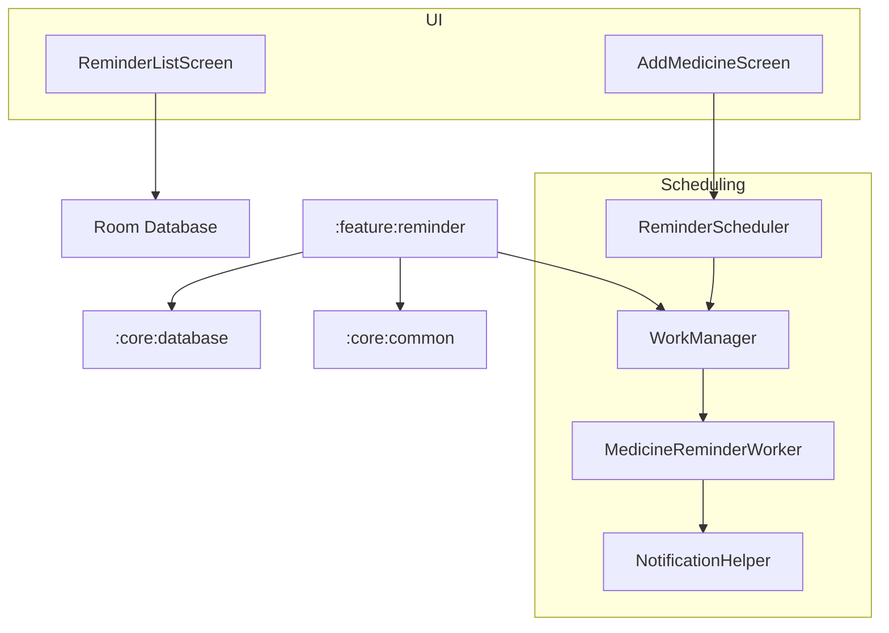

# Implementation Plan - Phase 9: Medicine Reminder & Smart Notifications

Implement an intelligent medication scheduling and reminder system that leverages extracted prescription data and utilizes **WorkManager** for reliable background notifications.

## User Review Required

> [!IMPORTANT]
> This phase involves background processing and system-level notifications.
>
> - **WorkManager**: We will use `WorkManager` for persistent scheduling, ensuring reminders work even after device reboots.
> - **High-Priority Notifications**: Medicine reminders will use a dedicated notification channel with high priority.
> - **Post-Notification Actions**: Support for "Taken", "Snooze", and "Skip" directly from the notification.
> - **Database**: Initializing Room database in `:core:database` to persist medication schedules.

## Proposed Changes

### Core Database (`:core:database`)

#### [NEW] [MedicineEntity.kt](file:///J:/Android/AndroidStudioProjects/Gemini/Ai-HealthCare-App/core/database/src/main/kotlin/com/mediai/enterprise/core/database/entity/MedicineEntity.kt)
- Store medication name, dosage, frequency, times, and duration.

#### [NEW] [MedicineDao.kt](file:///J:/Android/AndroidStudioProjects/Gemini/Ai-HealthCare-App/core/database/src/main/kotlin/com/mediai/enterprise/core/database/dao/MedicineDao.kt)
- Standard CRUD operations for medications.

#### [NEW] [MediAIDatabase.kt](file:///J:/Android/AndroidStudioProjects/Gemini/Ai-HealthCare-App/core/database/src/main/kotlin/com/mediai/enterprise/core/database/MediAIDatabase.kt)
- Room database initialization with Hilt provides.

### Feature Reminder (`:feature:reminder`) [NEW MODULE]

#### [NEW] [Feature Reminder Module Setup](file:///J:/Android/AndroidStudioProjects/Gemini/Ai-HealthCare-App/feature/reminder)
- Create `:feature:reminder` module using convention plugins.

#### [NEW] [MedicineReminderWorker.kt](file:///J:/Android/AndroidStudioProjects/Gemini/Ai-HealthCare-App/feature/reminder/src/main/kotlin/com/mediai/enterprise/feature/reminder/worker/MedicineReminderWorker.kt)
- `CoroutineWorker` that triggers notifications based on scheduled times.

#### [NEW] [ReminderScheduler.kt](file:///J:/Android/AndroidStudioProjects/Gemini/Ai-HealthCare-App/feature/reminder/src/main/kotlin/com/mediai/enterprise/feature/reminder/service/ReminderScheduler.kt)
- Helper class to schedule/cancel `WorkManager` tasks for medications.

#### [NEW] [UI Layer - Screens](file:///J:/Android/AndroidStudioProjects/Gemini/Ai-HealthCare-App/feature/reminder/src/main/kotlin/com/mediai/enterprise/feature/reminder/presentation)
- **ReminderListScreen**: Daily timeline of medications.
- **AddMedicineScreen**: Form to manually add or edit medication reminders.

### Core Common (`:core:common`)

#### [NEW] [NotificationHelper.kt](file:///J:/Android/AndroidStudioProjects/Gemini/Ai-HealthCare-App/core/common/src/main/kotlin/com/mediai/enterprise/core/common/NotificationHelper.kt)
- Utility to manage notification channels and show alerts.

### Navigation (`:core:navigation`)

#### [MODIFY] [MediAINavDestinations.kt](file:///J:/Android/AndroidStudioProjects/Gemini/Ai-HealthCare-App/core/navigation/src/main/kotlin/com/mediai/enterprise/core/navigation/MediAINavDestinations.kt)
- Add `REMINDERS_ROUTE`.

## Architecture Diagram

## Verification Plan

### Automated Tests
- **Database Tests**: Verify Room entity and DAO operations.
- **Worker Tests**: Test `WorkManager` scheduling logic using `TestListenableWorkerBuilder`.

### Manual Verification
- Schedule a reminder and verify the notification appears at the correct time.
- Test "Snooze" and "Taken" actions from the notification.
- Verify that reminders persist after an app restart.
