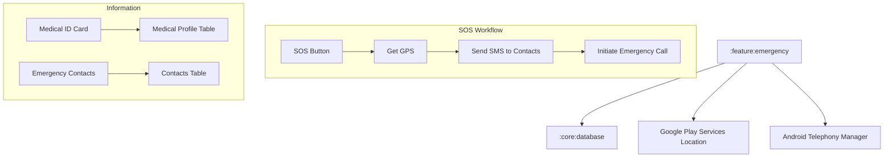

# Implementation Plan - Phase 10: Emergency Module

Implement critical safety features including One-Tap SOS, GPS location sharing, Emergency Contacts, and a Medical ID card for **MediAI Enterprise**.

## User Review Required

> [!IMPORTANT]
> This phase involves system-level permissions and safety-critical features.
>
> - **Permissions**: The app will request `ACCESS_FINE_LOCATION`, `SEND_SMS`, and `CALL_PHONE` permissions.
> - **SOS Logic**: One-tap SOS will fetch current GPS coordinates and send an SMS with a Google Maps link to all emergency contacts.
> - **Medical ID**: A quick-access screen displaying Blood Group, Allergies, and Chronic Conditions, accessible even from a "locked" state (simulated via high-priority notification or dashboard shortcut).

## Proposed Changes

### Core Database (`:core:database`)

#### [MODIFY] [MedicineDao.kt](file:///J:/Android/AndroidStudioProjects/Gemini/Ai-HealthCare-App/core/database/src/main/kotlin/com/mediai/enterprise/core/database/dao/MedicineDao.kt)
- Add DAO methods for Emergency Contacts and Medical Profile.

#### [NEW] [EmergencyContactEntity.kt](file:///J:/Android/AndroidStudioProjects/Gemini/Ai-HealthCare-App/core/database/src/main/kotlin/com/mediai/enterprise/core/database/entity/EmergencyContactEntity.kt)
- Store name and phone number of emergency contacts.

#### [NEW] [MedicalProfileEntity.kt](file:///J:/Android/AndroidStudioProjects/Gemini/Ai-HealthCare-App/core/database/src/main/kotlin/com/mediai/enterprise/core/database/entity/MedicalProfileEntity.kt)
- Store Blood Group, Allergies, Medications, and Emergency Instructions.

### Feature Emergency (`:feature:emergency`) [NEW MODULE]

#### [NEW] [Feature Emergency Module Setup](file:///J:/Android/AndroidStudioProjects/Gemini/Ai-HealthCare-App/feature/emergency)
- Create `:feature:emergency` module using convention plugins.

#### [NEW] [LocationManager.kt](file:///J:/Android/AndroidStudioProjects/Gemini/Ai-HealthCare-App/feature/emergency/src/main/kotlin/com/mediai/enterprise/feature/emergency/service/LocationManager.kt)
- Use FusedLocationProviderClient to get high-accuracy coordinates.

#### [NEW] [SosService.kt](file:///J:/Android/AndroidStudioProjects/Gemini/Ai-HealthCare-App/feature/emergency/src/main/kotlin/com/mediai/enterprise/feature/emergency/service/SosService.kt)
- Orchestrate the SOS flow: Get Location -> Send SMS -> Initiate Call.

#### [NEW] [UI Layer - Screens](file:///J:/Android/AndroidStudioProjects/Gemini/Ai-HealthCare-App/feature/emergency/src/main/kotlin/com/mediai/enterprise/feature/emergency/presentation)
- **EmergencyDashboardScreen**: Large SOS button and quick links.
- **MedicalIdScreen**: Visual card with critical health info.
- **ContactListScreen**: Manage emergency contacts.

### Navigation (`:core:navigation`)

#### [MODIFY] [MediAINavDestinations.kt](file:///J:/Android/AndroidStudioProjects/Gemini/Ai-HealthCare-App/core/navigation/src/main/kotlin/com/mediai/enterprise/core/navigation/MediAINavDestinations.kt)
- Add `EMERGENCY_ROUTE`.

## Architecture Diagram

## Verification Plan

### Automated Tests
- **Unit Tests**: Verify SMS message formatting with location coordinates.
- **Database Tests**: Verify CRUD for emergency contacts and medical profile.

### Manual Verification
- Trigger SOS and verify that location is fetched (mocked in emulator if necessary).
- Verify the Medical ID card layout for readability in stressful situations.
- Test permission handling (Allow/Deny scenarios).
