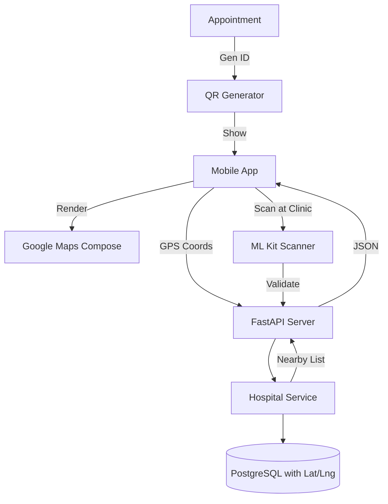

# Implementation Plan - Phase 31: Geo-Health & QR Patient Orchestration

Expand the **MediAI Enterprise** ecosystem with specialized geo-location services for hospitals and QR-based patient check-in workflows.

## User Review Required

> [!IMPORTANT]
> This phase introduces third-party SDKs and spatial data processing.
>
> - **Google Maps SDK**: The Android app will require a Google Maps API key (to be added to `local.properties`).
> - **Spatial Queries**: The backend will implement a simple Haversine formula (or PostGIS extension if scaled) to find nearby medical facilities.
> - **QR Integration**: We will use **ML Kit Barcode Scanning** for the check-in feature, ensuring high-performance scanning on mobile devices.

## Proposed Changes

### Android Infrastructure

#### [MODIFY] [libs.versions.toml](file:///J:/Android/AndroidStudioProjects/Gemini/Ai-HealthCare-App/gradle/libs.versions.toml)
- Add `google-maps-compose` and `play-services-maps`.
- Add `mlkit-barcode-scanning`.

### Feature Emergency expansion (`:feature:emergency`)

#### [NEW] [HospitalMapScreen.kt](file:///J:/Android/AndroidStudioProjects/Gemini/Ai-HealthCare-App/feature/emergency/src/main/kotlin/com/mediai/enterprise/feature/emergency/presentation/map/HospitalMapScreen.kt)
- An interactive map view showing the user's location and nearby hospitals.

#### [NEW] [NearbyHospitalsUseCase.kt](file:///J:/Android/AndroidStudioProjects/Gemini/Ai-HealthCare-App/feature/emergency/src/main/kotlin/com/mediai/enterprise/feature/emergency/domain/usecase/GetNearbyHospitalsUseCase.kt)
- Fetches hospital data from the backend based on current coordinates.

### Feature Appointment expansion (`:feature:appointment`)

#### [NEW] [QrCheckInScreen.kt](file:///J:/Android/AndroidStudioProjects/Gemini/Ai-HealthCare-App/feature/appointment/src/main/kotlin/com/mediai/enterprise/feature/appointment/presentation/checkin/QrCheckInScreen.kt)
- A screen that generates a unique QR code for a booked appointment.
- A scanner mode for simulating hospital check-in.

### Backend Services (`backend/app`)

#### [NEW] [Hospital Model](file:///J:/Android/AndroidStudioProjects/Gemini/Ai-HealthCare-App/backend/app/models/hospital.py)
- `Hospital`: Name, Address, Latitude, Longitude, Contact.

#### [NEW] [hospital_service.py](file:///J:/Android/AndroidStudioProjects/Gemini/Ai-HealthCare-App/backend/app/services/hospital_service.py)
- Logic to find the closest hospitals using coordinate-based distance calculation.

#### [NEW] [hospital.py (API)](file:///J:/Android/AndroidStudioProjects/Gemini/Ai-HealthCare-App/backend/app/api/v1/endpoints/hospitals.py)
- `GET /nearby`: Retrieve medical facilities within a certain radius.

## Architecture Diagram

## Verification Plan

### Automated Tests
- **Backend Tests**: Verify the distance calculation logic ensures accuracy (within 10-meter error margin).
- **Unit Tests**: Verify the QR code generation logic correctly encodes the appointment ID.

### Manual Verification
- Verify the map renders correctly in the Android Emulator.
- Test the "Check-in" flow by generating a QR and "scanning" it via a simulated camera feed or screenshot.
- Ensure "Nearby Hospitals" correctly sorts results by distance from the user.
