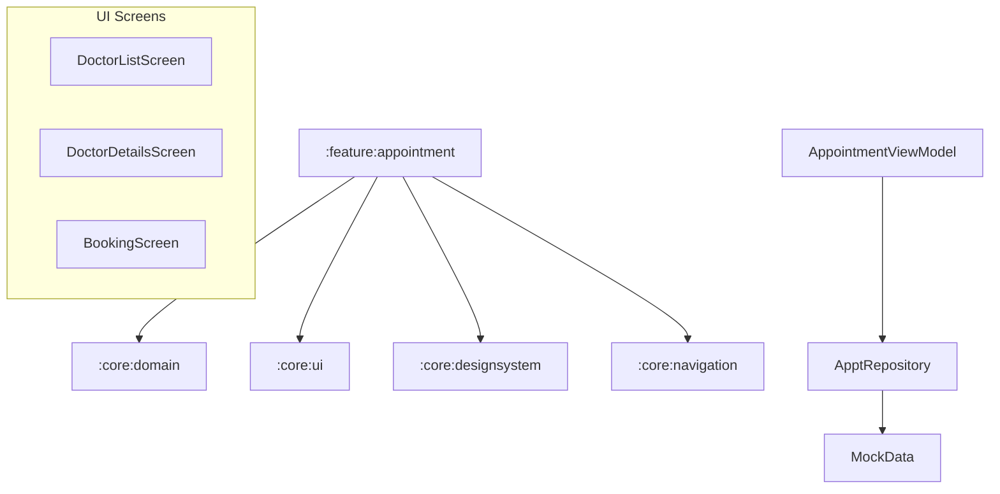

# Implementation Plan - Phase 7: Doctor Appointment

Implement the doctor discovery and appointment booking ecosystem for **MediAI Enterprise**.

## User Review Required

> [!IMPORTANT]
> This phase introduces a complex booking workflow and data models for healthcare providers.
>
> - **Booking Logic**: We will implement a multi-step booking flow (Select Doctor -> Select Slot -> Confirm).
> - **Search & Filter**: Robust filtering by specialization and rating.
> - **Slot Management**: Handling availability logic (mocked for this phase).

## Proposed Changes

### Feature Appointment (`:feature:appointment`) [NEW MODULE]

#### [NEW] [Feature Appointment Module Setup](file:///J:/Android/AndroidStudioProjects/Gemini/Ai-HealthCare-App/feature/appointment)
- Create `:feature:appointment` module using the `mediai.android.library`, `mediai.android.compose`, and `mediai.android.hilt` convention plugins.

#### [NEW] [Domain Layer](file:///J:/Android/AndroidStudioProjects/Gemini/Ai-HealthCare-App/feature/appointment/src/main/kotlin/com/mediai/enterprise/feature/appointment/domain)
- **Doctor** model: Name, Specialization, Rating, Experience, Hospital.
- **Appointment** model: DateTime, DoctorId, Status, Type (Video/In-person).
- **TimeSlot** model: StartTime, EndTime, IsAvailable.
- UseCases: `SearchDoctorsUseCase`, `GetDoctorDetailsUseCase`, `BookAppointmentUseCase`.

#### [NEW] [Data Layer](file:///J:/Android/AndroidStudioProjects/Gemini/Ai-HealthCare-App/feature/appointment/src/main/kotlin/com/mediai/enterprise/feature/appointment/data)
- `AppointmentRepository`: Manage doctor searches and booking operations.
- Mock data source for various specializations (Cardiology, Neurology, Pediatrics, etc.).

#### [NEW] [UI Layer - Screens](file:///J:/Android/AndroidStudioProjects/Gemini/Ai-HealthCare-App/feature/appointment/src/main/kotlin/com/mediai/enterprise/feature/appointment/presentation)
- **DoctorListScreen**: Search bar, category filters, and doctor cards.
- **DoctorDetailsScreen**: Detailed bio, ratings, and "Book Now" action.
- **BookingScreen**: Date picker and time slot selection grid.
- **AppointmentViewModel**: State management for search and booking.

### Navigation (`:core:navigation`)

#### [MODIFY] [MediAINavDestinations.kt](file:///J:/Android/AndroidStudioProjects/Gemini/Ai-HealthCare-App/core/navigation/src/main/kotlin/com/mediai/enterprise/core/navigation/MediAINavDestinations.kt)
- Add `DOCTOR_LIST_ROUTE`, `DOCTOR_DETAILS_ROUTE`, and `BOOKING_ROUTE`.

#### [NEW] [AppointmentNavigation.kt](file:///J:/Android/AndroidStudioProjects/Gemini/Ai-HealthCare-App/feature/appointment/src/main/kotlin/com/mediai/enterprise/feature/appointment/navigation/AppointmentNavigation.kt)
- Define the appointment navigation graph.

### App Module Updates

#### [MODIFY] [MainActivity.kt](file:///J:/Android/AndroidStudioProjects/Gemini/Ai-HealthCare-App/app/src/main/kotlin/com/mediai/enterprise/MainActivity.kt)
- Integrate `appointmentGraph` into the `NavHost`.
- Update Dashboard (Home) to navigate to the Appointment feature.

## Architecture Diagram

## Verification Plan

### Automated Tests
- **Unit Tests**: Verify filtering logic in `SearchDoctorsUseCase`.
- **ViewModel Tests**: Verify booking state transitions.
- **Compose Previews**: Previews for doctor cards and slot selection UI.

### Manual Verification
- Test searching for a doctor and navigating through the full booking flow.
- Verify the responsive grid layout for time slots on mobile and tablet.
