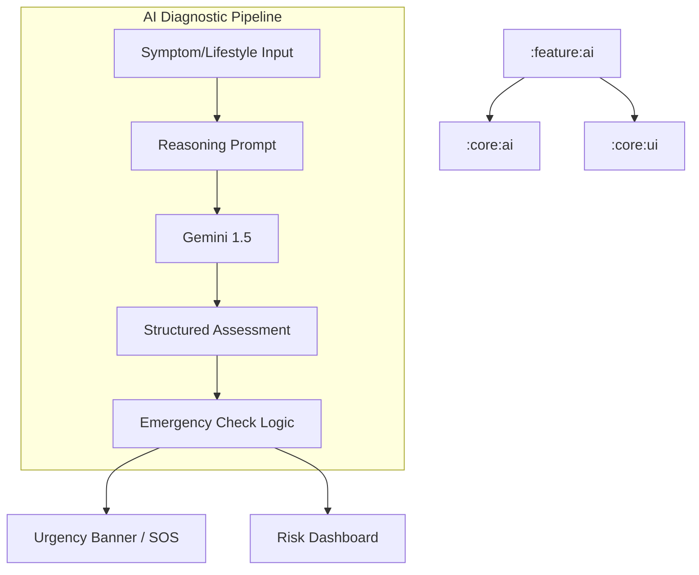

# Implementation Plan - Phase 14: AI Symptom Checker & Risk Prediction

Implement a diagnostic-assist tool for **MediAI Enterprise** that assesses user-reported symptoms and predicts risks for chronic conditions using **Gemini 1.5 Pro/Flash**.

## User Review Required

> [!CAUTION]
> This feature provides **AI-generated health assessments** which must be clearly distinguished from medical advice.
>
> - **Medical Disclaimer**: Every assessment will be accompanied by a strict disclaimer that the results are probabilistic and require clinical validation.
> - **Emergency Detection**: If symptoms suggest a critical condition (e.g., heart attack, stroke), the UI will immediately highlight the **SOS Emergency Button**.
> - **Risk Models**: We will focus on predicting risks for Diabetes, Hypertension, Heart Disease, and Kidney Disease based on user input.

## Proposed Changes

### Core AI (`:core:ai`)

#### [NEW] [MedicalDiagnosticsAi.kt](file:///J:/Android/AndroidStudioProjects/Gemini/Ai-HealthCare-App/core/ai/src/main/kotlin/com/mediai/enterprise/core/ai/MedicalDiagnosticsAi.kt)
- Specialized service to:
    - Analyze symptoms and identify potential conditions.
    - Assess risk levels for chronic diseases based on lifestyle/symptom data.
    - Provide "Explainability" for each risk factor.

### Feature AI (`:feature:ai`) [NEW MODULE]

#### [NEW] [Feature AI Module Setup](file:///J:/Android/AndroidStudioProjects/Gemini/Ai-HealthCare-App/feature/ai)
- Create `:feature:ai` module using convention plugins.

#### [NEW] [Domain Layer](file:///J:/Android/AndroidStudioProjects/Gemini/Ai-HealthCare-App/feature/ai/src/main/kotlin/com/mediai/enterprise/feature/ai/domain)
- **SymptomAssessment** model: Conditions, Risk Level, Urgency, Specialist recommendation.
- **RiskPrediction** model: Condition (e.g., Diabetes), Probability, Risk Factors, Lifestyle Advice.
- UseCases: `CheckSymptomsUseCase`, `GetRiskPredictionsUseCase`.

#### [NEW] [UI Layer - Screens](file:///J:/Android/AndroidStudioProjects/Gemini/Ai-HealthCare-App/feature/ai/src/main/kotlin/com/mediai/enterprise/feature/ai/presentation)
- **SymptomCheckerScreen**: Multi-select or natural language input for symptoms.
- **RiskDashboardScreen**: Visual representation (charts/gauges) of predicted risks.
- **AssessmentDetailScreen**: Detailed breakdown of a specific assessment.

#### [NEW] [UI Layer - Components](file:///J:/Android/AndroidStudioProjects/Gemini/Ai-HealthCare-App/feature/ai/src/main/kotlin/com/mediai/enterprise/feature/ai/presentation/components)
- **RiskGauge**: A visual circular gauge for probability scores.
- **UrgencyBanner**: High-visibility banner for emergency redirection.

### Navigation (`:core:navigation`)

#### [MODIFY] [MediAINavDestinations.kt](file:///J:/Android/AndroidStudioProjects/Gemini/Ai-HealthCare-App/core/navigation/src/main/kotlin/com/mediai/enterprise/core/navigation/MediAINavDestinations.kt)
- Add `SYMPTOM_CHECKER_ROUTE` and `RISK_PREDICTION_ROUTE`.

## Architecture Diagram

## Verification Plan

### Automated Tests
- **Unit Tests**: Verify that symptoms like "Chest Pain" trigger the "HIGH" urgency/emergency status in the parser.
- **Unit Tests**: Verify the parsing of Gemini's JSON output for risk predictions.

### Manual Verification
- Enter "Frequent thirst and fatigue" and verify if "Diabetes" risk is identified.
- Enter "Severe chest pain" and verify the SOS redirection.
- Check accessibility of the risk gauges and charts.
