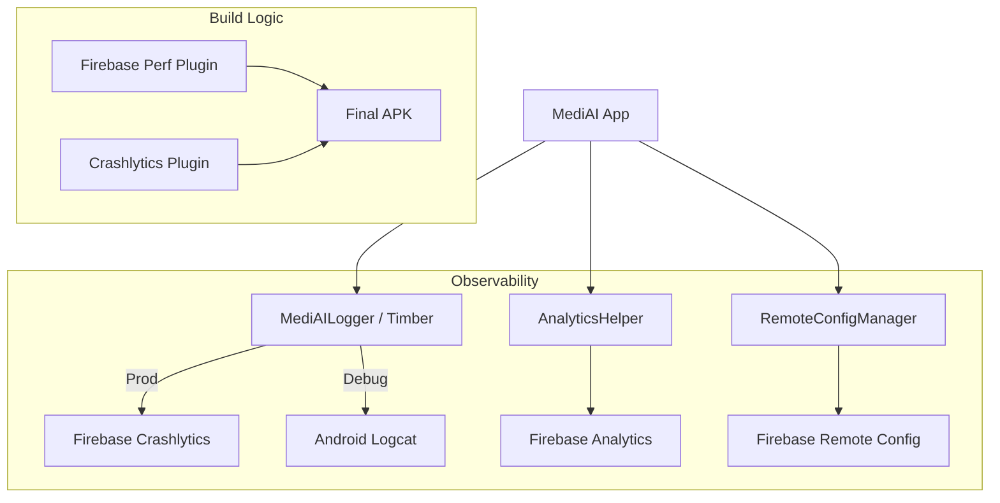

# Implementation Plan - Phase 19: Observability & Monitoring

Implement a production-grade monitoring suite for **MediAI Enterprise**, including crash reporting, performance tracking, structured logging, and remote configuration.

## User Review Required

> [!IMPORTANT]
> This phase establishes how we monitor the app's health in the wild.
>
> - **Firebase Suite**: We will integrate Analytics, Crashlytics, Performance Monitoring, and Remote Config.
> - **Structured Logging**: We will use **Timber** for organized logging, with a custom `Tree` that sends errors to Crashlytics in production.
> - **Feature Flags**: Remote Config will be used to toggle experimental AI features (like the new Health Coach) without requiring a new app release.

## Proposed Changes

### Build Configuration

#### [MODIFY] [libs.versions.toml](file:///J:/Android/AndroidStudioProjects/Gemini/Ai-HealthCare-App/gradle/libs.versions.toml)
- Add libraries for:
    - `firebase-analytics-ktx`
    - `firebase-crashlytics-ktx`
    - `firebase-perf-ktx`
    - `firebase-config-ktx`
    - `timber`

#### [MODIFY] [build.gradle.kts (root)](file:///J:/Android/AndroidStudioProjects/Gemini/Ai-HealthCare-App/build.gradle.kts)
- Apply Google Services and Firebase Crashlytics/Performance plugins.

### Core Analytics (`:core:analytics`)

#### [NEW] [AnalyticsHelper.kt](file:///J:/Android/AndroidStudioProjects/Gemini/Ai-HealthCare-App/core/analytics/src/main/kotlin/com/mediai/enterprise/core/analytics/AnalyticsHelper.kt)
- Unified interface for logging events (e.g., `logEvent(name, params)`).

#### [NEW] [FirebaseAnalyticsHelper.kt](file:///J:/Android/AndroidStudioProjects/Gemini/Ai-HealthCare-App/core/analytics/src/main/kotlin/com/mediai/enterprise/core/analytics/FirebaseAnalyticsHelper.kt)
- Firebase implementation of the analytics interface.

#### [NEW] [RemoteConfigManager.kt](file:///J:/Android/AndroidStudioProjects/Gemini/Ai-HealthCare-App/core/analytics/src/main/kotlin/com/mediai/enterprise/core/analytics/RemoteConfigManager.kt)
- Fetch and provide feature flags (e.g., `isAiCoachEnabled`).

### Core Common (`:core:common`)

#### [NEW] [MediAILogger.kt](file:///J:/Android/AndroidStudioProjects/Gemini/Ai-HealthCare-App/core/common/src/main/kotlin/com/mediai/enterprise/core/common/util/MediAILogger.kt)
- Initialize **Timber**.
- Implement `CrashlyticsTree` for production builds to report non-fatal exceptions.

### Feature Integration

#### [MODIFY] [MediAIApp.kt](file:///J:/Android/AndroidStudioProjects/Gemini/Ai-HealthCare-App/app/src/main/kotlin/com/mediai/enterprise/MediAIApp.kt)
- Initialize Logging and Remote Config on app startup.

## Architecture Diagram

## Verification Plan

### Automated Tests
- **Unit Tests**: Verify that `AnalyticsHelper` correctly formats parameters before sending to Firebase.
- **Unit Tests**: Verify default values in `RemoteConfigManager`.

### Manual Verification
- Verify that logs appear in Logcat during development.
- (In a real setup) Check the Firebase Console for logged events and performance traces.
- Toggle a feature flag in Remote Config and verify the UI updates (e.g., hiding/showing a button).
