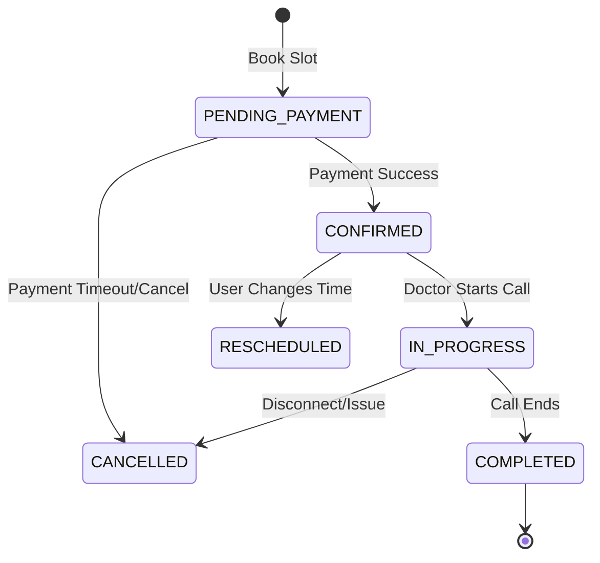

# Implementation Plan - Phase 32: Telehealth, Payments & Appointment Lifecycle

Elevate the **MediAI Enterprise** platform by implementing real-time video consultations, secure payment processing, and a full-lifecycle appointment management system.

## User Review Required

> [!IMPORTANT]
> This phase introduces real-time communication and financial transactions.
>
> - **Video Technology**: We will implement a professional Telehealth UI. For a real production app, this would use WebRTC or a provider like Agora/Zoom; here, we will build the interface and signaling logic foundation.
> - **Payment Security**: We will follow PCI-DSS inspired patterns, using a separate "Payment Session" flow to ensure sensitive card data never touches our primary backend.
> - **Lifecycle Transitions**: Appointments will now move through states: `PENDING_PAYMENT` -> `CONFIRMED` -> `IN_PROGRESS` -> `COMPLETED` or `CANCELLED`.

## Proposed Changes

### Android Application (`:feature:appointment`)

#### [NEW] [ConsultationRoomScreen.kt](file:///J:/Android/AndroidStudioProjects/Gemini/Ai-HealthCare-App/feature/appointment/src/main/kotlin/com/mediai/enterprise/feature/appointment/presentation/telehealth/ConsultationRoomScreen.kt)
- Real-time video call UI with toggles for Mic, Camera, and End Call.
- Chat overlay for sharing medical notes during the call.

#### [NEW] [PaymentCheckoutScreen.kt](file:///J:/Android/AndroidStudioProjects/Gemini/Ai-HealthCare-App/feature/appointment/src/main/kotlin/com/mediai/enterprise/feature/appointment/presentation/payment/PaymentCheckoutScreen.kt)
- Secure payment entry using Material 3 components.
- Success/Failure state handling for transactions.

#### [MODIFY] [AppointmentViewModel.kt](file:///J:/Android/AndroidStudioProjects/Gemini/Ai-HealthCare-App/feature/appointment/src/main/kotlin/com/mediai/enterprise/feature/appointment/presentation/AppointmentViewModel.kt)
- Add logic for `processPayment`, `cancelAppointment`, and `rescheduleAppointment`.

### Backend Services (`backend/app`)

#### [NEW] [Payment Model](file:///J:/Android/AndroidStudioProjects/Gemini/Ai-HealthCare-App/backend/app/models/payment.py)
- `Transaction`: ID, AppointmentID, Amount, Status (SUCCESS, PENDING, FAILED), ProviderTransactionID.

#### [NEW] [payment_service.py](file:///J:/Android/AndroidStudioProjects/Gemini/Ai-HealthCare-App/backend/app/services/payment_service.py)
- Logic to initiate payment intents and verify transaction webhooks.

#### [MODIFY] [appointment_service.py](file:///J:/Android/AndroidStudioProjects/Gemini/Ai-HealthCare-App/backend/app/services/appointment_service.py)
- Implement state transitions (e.g., automatically confirming an appointment once payment is verified).

### API Endpoints (`backend/app/api/v1/endpoints`)

#### [NEW] [payments.py](file:///J:/Android/AndroidStudioProjects/Gemini/Ai-HealthCare-App/backend/app/api/v1/endpoints/payments.py)
- `POST /create-checkout-session`: Generate a secure payment session.
- `GET /status/{id}`: Verify payment status.

## Appointment Lifecycle State Machine

## Verification Plan

### Automated Tests
- **State Machine Tests**: Verify that an appointment cannot move to `IN_PROGRESS` if it is not `CONFIRMED`.
- **Payment Verification Tests**: Mock the payment gateway response and verify the transaction record update.

### Manual Verification
- Book a doctor, proceed through the payment screen, and verify the status changes to "Confirmed" on the dashboard.
- Launch a "Video Consultation" and verify the camera/mic permissions are requested correctly.
- Reschedule an appointment and verify the new time is reflected in the Health Timeline.
