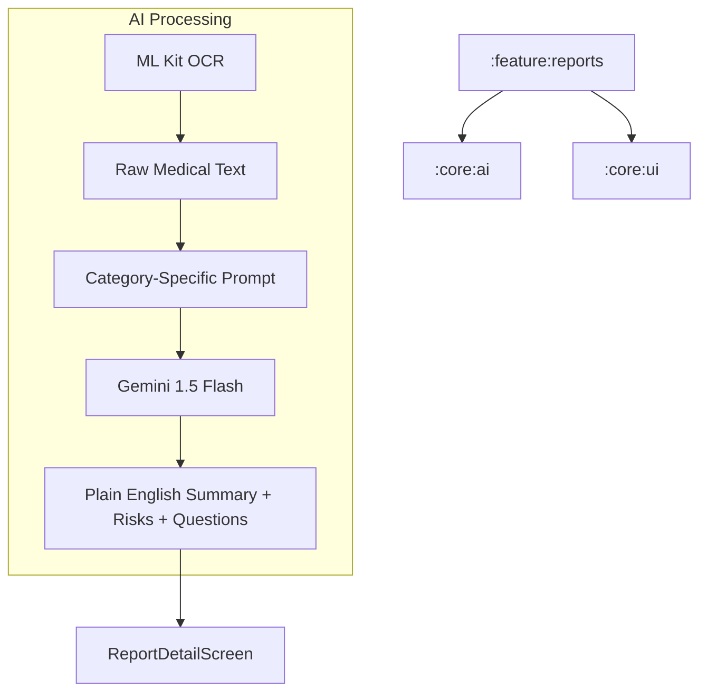

# Implementation Plan - Phase 13: AI Report Summarization

Build a specialized AI tool to analyze complex medical documents (Blood tests, MRI, CT scans) and provide patient-friendly summaries, risk indicators, and suggested follow-up questions.

## User Review Required

> [!IMPORTANT]
> This phase focuses on the **Multimodal Interpretation** of medical data.
>
> - **Specialized Prompts**: We will use specialized AI prompt templates for different report categories (e.g., Blood Test vs. MRI).
> - **Risk Detection**: The AI will highlight potential "Risk Indicators" found in the report, accompanied by a mandatory medical disclaimer.
> - **Patient Education**: The goal is to translate medical jargon into plain English to empower patients during doctor consultations.

## Proposed Changes

### Core AI (`:core:ai`)

#### [NEW] [MedicalReportSummarizer.kt](file:///J:/Android/AndroidStudioProjects/Gemini/Ai-HealthCare-App/core/ai/src/main/kotlin/com/mediai/enterprise/core/ai/MedicalReportSummarizer.kt)
- Specialized service using **Gemini 1.5 Flash**.
- Features:
    - Plain English Summary generation.
    - Risk Factor extraction.
    - Suggested Questions for doctors.
    - Confidence Score calculation.

### Feature Reports (`:feature:reports`)

#### [NEW] [SummarizeReportUseCase.kt](file:///J:/Android/AndroidStudioProjects/Gemini/Ai-HealthCare-App/feature/reports/src/main/kotlin/com/mediai/enterprise/feature/reports/domain/usecase/SummarizeReportUseCase.kt)
- Orchestrates OCR extraction and the summarization service.

#### [MODIFY] [ReportRepository.kt](file:///J:/Android/AndroidStudioProjects/Gemini/Ai-HealthCare-App/feature/reports/src/main/kotlin/com/mediai/enterprise/feature/reports/domain/repository/ReportRepository.kt)
- Add method to fetch detailed report analysis.

#### [NEW] [UI Layer - Screens](file:///J:/Android/AndroidStudioProjects/Gemini/Ai-HealthCare-App/feature/reports/src/main/kotlin/com/mediai/enterprise/feature/reports/presentation/detail)
- **ReportDetailScreen**: Displays the original document and the AI analysis.
- **AiAnalysisSection**: Contains the summary, risks, and suggested questions.

#### [NEW] [UI Layer - Components](file:///J:/Android/AndroidStudioProjects/Gemini/Ai-HealthCare-App/feature/reports/src/main/kotlin/com/mediai/enterprise/feature/reports/presentation/components)
- **RiskIndicatorCard**: High-contrast card for potential health alerts.
- **QuestionList**: A list of actionable questions for the patient to ask their doctor.

### Navigation (`:core:navigation`)

#### [MODIFY] [MediAINavDestinations.kt](file:///J:/Android/AndroidStudioProjects/Gemini/Ai-HealthCare-App/core/navigation/src/main/kotlin/com/mediai/enterprise/core/navigation/MediAINavDestinations.kt)
- Ensure `REPORT_DETAIL_ROUTE` is mapped.

## Architecture Diagram

## Verification Plan

### Automated Tests
- **Unit Tests**: Verify that the correct prompt template is selected based on the report category.
- **Unit Tests**: Mock Gemini responses and verify the parsing of structured JSON analysis.

### Manual Verification
- Upload a sample Blood Test image and verify the "Risk Indicators" section.
- Verify that the "Suggested Questions" are relevant to the report content.
- Check the UI layout on Foldables/Tablets to ensure the report and analysis fit side-by-side.
