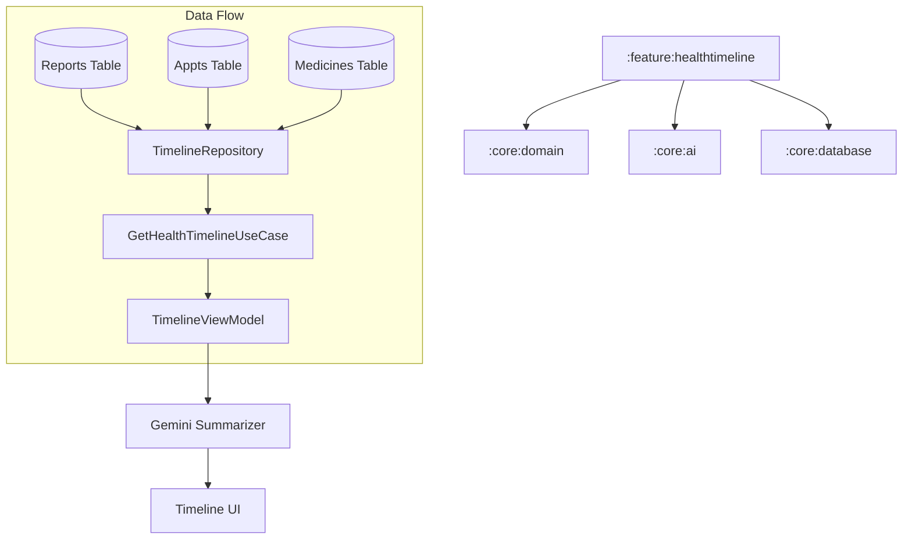

# Implementation Plan - Phase 11: Health Timeline

Consolidate all medical records, appointments, and medication history into a unified, chronological, and AI-summarized view for **MediAI Enterprise**.

## User Review Required

> [!IMPORTANT]
> This phase transitions the app from isolated features to an integrated health ecosystem.
>
> - **Data Consolidation**: We will aggregate data from three different sources: Medical Reports, Doctor Appointments, and Medication History.
> - **AI Summarization**: Using Gemini to provide a high-level "Health Narrative" based on the chronological events.
> - **Database Expansion**: Moving `Reports` and `Appointments` from mock data to Room entities in `:core:database`.

## Proposed Changes

### Core Database (`:core:database`)

#### [NEW] [ReportEntity.kt](file:///J:/Android/AndroidStudioProjects/Gemini/Ai-HealthCare-App/core/database/src/main/kotlin/com/mediai/enterprise/core/database/entity/ReportEntity.kt)
- Persist medical report metadata (title, category, date, file path, AI summary).

#### [NEW] [AppointmentEntity.kt](file:///J:/Android/AndroidStudioProjects/Gemini/Ai-HealthCare-App/core/database/src/main/kotlin/com/mediai/enterprise/core/database/entity/AppointmentEntity.kt)
- Persist appointment details (doctor name, date, type, status).

#### [NEW] [HealthDao.kt](file:///J:/Android/AndroidStudioProjects/Gemini/Ai-HealthCare-App/core/database/src/main/kotlin/com/mediai/enterprise/core/database/dao/HealthDao.kt)
- Combined DAO for fetching various health events ordered by date.

### Core AI (`:core:ai`)

#### [NEW] [HealthTimelineSummarizer.kt](file:///J:/Android/AndroidStudioProjects/Gemini/Ai-HealthCare-App/core/ai/src/main/kotlin/com/mediai/enterprise/core/ai/HealthTimelineSummarizer.kt)
- Gemini-powered service to analyze a list of health events and generate a concise summary of the user's recent medical history.

### Feature Health Timeline (`:feature:healthtimeline`) [NEW MODULE]

#### [NEW] [Feature Timeline Module Setup](file:///J:/Android/AndroidStudioProjects/Gemini/Ai-HealthCare-App/feature/healthtimeline)
- Create `:feature:healthtimeline` module.

#### [NEW] [Domain Layer](file:///J:/Android/AndroidStudioProjects/Gemini/Ai-HealthCare-App/feature/healthtimeline/src/main/kotlin/com/mediai/enterprise/feature/healthtimeline/domain)
- **TimelineItem** model: A sealed class representing different types of events (Report, Appointment, Medication).
- **GetHealthTimelineUseCase**: Business logic for merging and sorting data from multiple repositories.

#### [NEW] [UI Layer - Screens](file:///J:/Android/AndroidStudioProjects/Gemini/Ai-HealthCare-App/feature/healthtimeline/src/main/kotlin/com/mediai/enterprise/feature/healthtimeline/presentation)
- **HealthTimelineScreen**: A vertical timeline UI with sticky headers for months/years.
- **SummaryCard**: A prominent section at the top showing the Gemini-generated overview.

### Navigation (`:core:navigation`)

#### [MODIFY] [MediAINavDestinations.kt](file:///J:/Android/AndroidStudioProjects/Gemini/Ai-HealthCare-App/core/navigation/src/main/kotlin/com/mediai/enterprise/core/navigation/MediAINavDestinations.kt)
- Add `HEALTH_TIMELINE_ROUTE`.

## Architecture Diagram

## Verification Plan

### Automated Tests
- **Unit Tests**: Verify the merging and sorting logic in `GetHealthTimelineUseCase`.
- **Database Tests**: Verify queries for `ReportEntity` and `AppointmentEntity`.

### Manual Verification
- Add a report and an appointment, then check if they appear correctly in the timeline.
- Trigger the AI summary and verify it accurately reflects the events on the screen.
- Verify the scrolling performance with a large number of timeline items.
