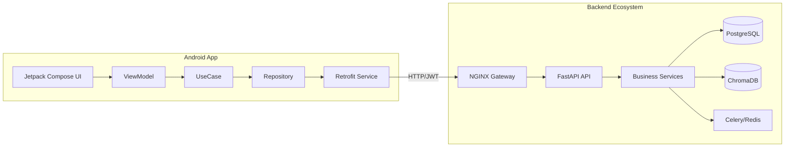

# Implementation Plan - Phase 29: Android-Backend Connectivity & Full-Stack Integration

Bridge the gap between the **MediAI Mobile App** and the **FastAPI Backend**, replacing all remaining mock data with live service integration.

## User Review Required

> [!IMPORTANT]
> This phase transitions the application from a standalone UI demo to a fully functional healthcare platform.
>
> - **API URL**: We will set the base URL to `http://10.0.2.2:80` (Standard Android Emulator gateway to host machine via Nginx).
> - **Live Flow**: Real registration, login, doctor search, and report uploads will now be functional.
> - **Data Persistence**: Data will move from the Mobile UI -> Android Repository -> FastAPI -> PostgreSQL/ChromaDB.

## Proposed Changes

### Android Network Layer (`:core:network`)

#### [MODIFY] [NetworkModule.kt](file:///J:/Android/AndroidStudioProjects/Gemini/Ai-HealthCare-App/core/network/src/main/kotlin/com/mediai/enterprise/core/network/di/NetworkModule.kt)
- Update `BASE_URL` to point to the Nginx gateway.

### Feature API Interfaces (`:feature:*`)

#### [NEW] [HomeApiService.kt](file:///J:/Android/AndroidStudioProjects/Gemini/Ai-HealthCare-App/feature/home/src/main/kotlin/com/mediai/enterprise/feature/home/data/remote/HomeApiService.kt)
- Endpoints for `GET /analytics/stats` and `GET /analytics/trends`.

#### [NEW] [AppointmentApiService.kt](file:///J:/Android/AndroidStudioProjects/Gemini/Ai-HealthCare-App/feature/appointment/src/main/kotlin/com/mediai/enterprise/feature/appointment/data/remote/AppointmentApiService.kt)
- Endpoints for doctor search, details, and booking.

#### [NEW] [ReportApiService.kt](file:///J:/Android/AndroidStudioProjects/Gemini/Ai-HealthCare-App/feature/reports/src/main/kotlin/com/mediai/enterprise/feature/reports/data/remote/ReportApiService.kt)
- Endpoints for report uploads and retrieval.

#### [NEW] [ChatApiService.kt](file:///J:/Android/AndroidStudioProjects/Gemini/Ai-HealthCare-App/feature/chatbot/src/main/kotlin/com/mediai/enterprise/feature/chatbot/data/remote/ChatApiService.kt)
- Endpoints for sending messages and history.

#### [NEW] [AiApiService.kt](file:///J:/Android/AndroidStudioProjects/Gemini/Ai-HealthCare-App/feature/ai/src/main/kotlin/com/mediai/enterprise/feature/ai/data/remote/AiApiService.kt)
- Endpoints for symptom checking and risk assessment.

### Repository Refactoring

#### [MODIFY] [All Repository Implementations](file:///J:/Android/AndroidStudioProjects/Gemini/Ai-HealthCare-App/feature/*/src/main/kotlin/com/mediai/enterprise/feature/*/data/repository/)
- Replace all `delay(1500)` and mock object returns with actual `apiService` calls.
- Implement proper mapping from Remote DTOs to Domain models.

### App Configuration

#### [MODIFY] [AndroidManifest.xml](file:///J:/Android/AndroidStudioProjects/Gemini/Ai-HealthCare-App/app/src/main/AndroidManifest.xml)
- Ensure `android:usesCleartextTraffic="true"` for local development (if not using HTTPS).

## Full-Stack Integration Diagram

## Verification Plan

### Automated Tests
- Run `Pytest` on the backend to ensure endpoints are ready.
- Run Android Unit Tests (MockK) ensuring repositories correctly call the `ApiService`.

### Manual Verification
- Perform a "Sign Up" in the app and verify the record exists in the `mediai_db` PostgreSQL container.
- Upload a medical report in the app and watch the `mediai_worker` logs process the AI analysis.
- Chat with the AI and verify the responses are grounded in the seeded knowledge base.
