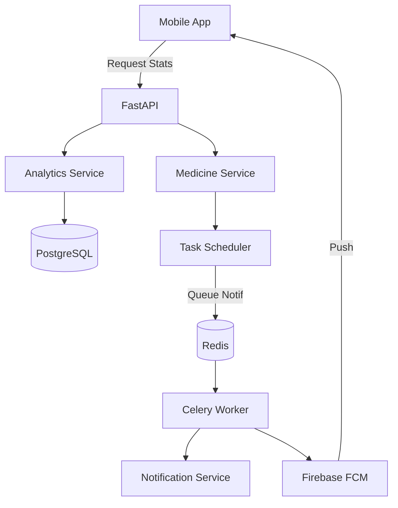

# Implementation Plan - Phase 26: Analytics, Notifications & Admin Services

Complete the feature set of the **MediAI Enterprise** backend by implementing long-term analytics, push notifications, and administrative controls.

## User Review Required

> [!IMPORTANT]
> This phase rounds out the backend functionality to support the full mobile experience.
>
> - **Analytics Engine**: We will implement complex SQL aggregations to calculate "Health Scores" and "Adherence Trends".
> - **FCM Integration**: The Notification Service will be the central hub for sending push alerts (Medicine reminders, Appointment confirmations).
> - **Admin Access**: We will introduce a `role` field to the `User` model to distinguish between Patients and Administrators.

## Proposed Changes

### API Schemas (`backend/app/schemas`)

#### [NEW] [analytics.py](file:///J:/Android/AndroidStudioProjects/Gemini/Ai-HealthCare-App/backend/app/schemas/analytics.py)
- `HealthSummary`, `TrendData`, `AdherenceScore`.

#### [NEW] [notification.py](file:///J:/Android/AndroidStudioProjects/Gemini/Ai-HealthCare-App/backend/app/schemas/notification.py)
- `PushNotification`, `NotificationLog`.

### Service Layer (`backend/app/services`)

#### [NEW] [analytics_service.py](file:///J:/Android/AndroidStudioProjects/Gemini/Ai-HealthCare-App/backend/app/services/analytics_service.py)
- Logic to compute weekly/monthly vitals trends and AI-driven health scores.

#### [NEW] [notification_service.py](file:///J:/Android/AndroidStudioProjects/Gemini/Ai-HealthCare-App/backend/app/services/notification_service.py)
- Integration with **Firebase Cloud Messaging (FCM)**.
- Method to queue notifications for async delivery via Celery.

#### [NEW] [medicine_service.py](file:///J:/Android/AndroidStudioProjects/Gemini/Ai-HealthCare-App/backend/app/services/medicine_service.py)
- Manage medication schedules and adherence logs.

### API Endpoints (`backend/app/api/v1/endpoints`)

#### [NEW] [analytics.py](file:///J:/Android/AndroidStudioProjects/Gemini/Ai-HealthCare-App/backend/app/api/v1/endpoints/analytics.py)
- `GET /stats`: Fetch user health statistics.

#### [NEW] [admin.py](file:///J:/Android/AndroidStudioProjects/Gemini/Ai-HealthCare-App/backend/app/api/v1/endpoints/admin.py)
- `POST /doctors`: Add/Update doctors (Admin only).
- `POST /knowledge`: Add documents to the RAG knowledge base.

### Model Updates (`backend/app/models`)

#### [MODIFY] [user.py](file:///J:/Android/AndroidStudioProjects/Gemini/Ai-HealthCare-App/backend/app/models/user.py)
- Add `is_admin` boolean field.
- Add `fcm_token` field for push notifications.

## Architecture Diagram

## Verification Plan

### Automated Tests
- **Analytics Tests**: Verify the SQL aggregation logic for calculating average heart rate and step counts.
- **Permission Tests**: Ensure a non-admin user cannot access `/admin` endpoints.

### Manual Verification
- Manually trigger a "Medicine Reminder" task and verify the log shows a notification was dispatched.
- Update a user's `is_admin` flag in the DB and verify access to administrative tools in Swagger.
