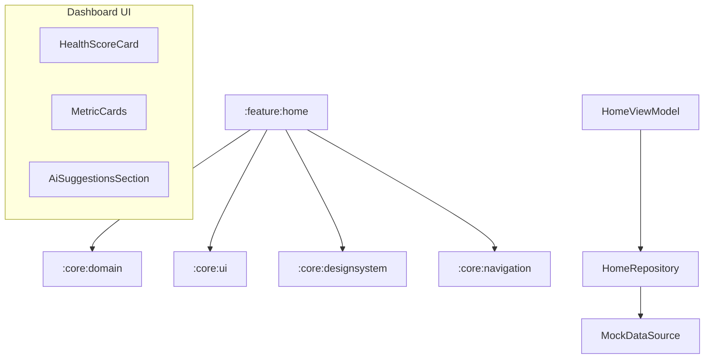

# Implementation Plan - Phase 6: Dashboard

Implement the main landing page of **MediAI Enterprise**, providing a comprehensive overview of the user's health status, upcoming tasks, and AI-driven insights.

## User Review Required

> [!IMPORTANT]
> This phase introduces the main user interface and the first integration of health metrics.
>
> - **Modular UI**: We will create the `:feature:home` module.
> - **Health Metrics**: Initial implementation of Health Score, Water Intake, and Sleep tracking cards.
> - **AI Integration**: A dedicated section for "AI Suggestions" that will eventually pull data from the Gemini-powered analysis engine.
> - **Data Mocking**: Since the backend is not yet fully implemented, we will use mock data sources for initial dashboard population.

## Proposed Changes

### Feature Home (`:feature:home`) [NEW MODULE]

#### [NEW] [Feature Home Module Setup](file:///J:/Android/AndroidStudioProjects/Gemini/Ai-HealthCare-App/feature/home)
- Create `:feature:home` module using the `mediai.android.library`, `mediai.android.compose`, and `mediai.android.hilt` convention plugins.

#### [NEW] [Domain Layer](file:///J:/Android/AndroidStudioProjects/Gemini/Ai-HealthCare-App/feature/home/src/main/kotlin/com/mediai/enterprise/feature/home/domain)
- Define `HealthMetrics` model (Heart Rate, Blood Pressure, Weight, etc.).
- Define `DashboardData` model (Health Score, Daily Goals, Upcoming Appointment).
- Create `GetDashboardDataUseCase`.

#### [NEW] [Data Layer](file:///J:/Android/AndroidStudioProjects/Gemini/Ai-HealthCare-App/feature/home/src/main/kotlin/com/mediai/enterprise/feature/home/data)
- Implement `HomeRepository` to fetch dashboard data (from local Room cache or mock remote).

#### [NEW] [UI Layer - Components](file:///J:/Android/AndroidStudioProjects/Gemini/Ai-HealthCare-App/feature/home/src/main/kotlin/com/mediai/enterprise/feature/home/presentation/components)
- **HealthScoreCard**: Circular indicator for the overall health score.
- **MetricCard**: Reusable card for single metrics (Water, Sleep, Steps).
- **AiSuggestionsSection**: Horizontal list of AI-generated health tips.

#### [NEW] [UI Layer - Screen](file:///J:/Android/AndroidStudioProjects/Gemini/Ai-HealthCare-App/feature/home/src/main/kotlin/com/mediai/enterprise/feature/home/presentation/HomeScreen.kt)
- The main scrolling dashboard containing all health segments.
- **HomeViewModel**: Managing the dashboard state and loading logic.

### Navigation (`:core:navigation`)

#### [MODIFY] [MediAINavDestinations.kt](file:///J:/Android/AndroidStudioProjects/Gemini/Ai-HealthCare-App/core/navigation/src/main/kotlin/com/mediai/enterprise/core/navigation/MediAINavDestinations.kt)
- Ensure `HOME_ROUTE` is correctly defined.

#### [NEW] [HomeNavigation.kt](file:///J:/Android/AndroidStudioProjects/Gemini/Ai-HealthCare-App/feature/home/src/main/kotlin/com/mediai/enterprise/feature/home/navigation/HomeNavigation.kt)
- Define the home graph and navigation entry point.

### App Module Updates

#### [MODIFY] [MainActivity.kt](file:///J:/Android/AndroidStudioProjects/Gemini/Ai-HealthCare-App/app/src/main/kotlin/com/mediai/enterprise/MainActivity.kt)
- Add the `homeGraph` to the `NavHost`.
- Handle navigation from Login success to Home.

## Architecture Diagram

## Verification Plan

### Automated Tests
- **Unit Tests**: Test `GetDashboardDataUseCase`.
- **ViewModel Tests**: Verify initial loading state and data population in `HomeViewModel`.
- **Compose Previews**: Previews for `HealthScoreCard` and `MetricCard` in light/dark modes.

### Manual Verification
- Verify the dashboard layout on different screen sizes (Phone and Tablet).
- Check responsiveness when navigating from Login.
