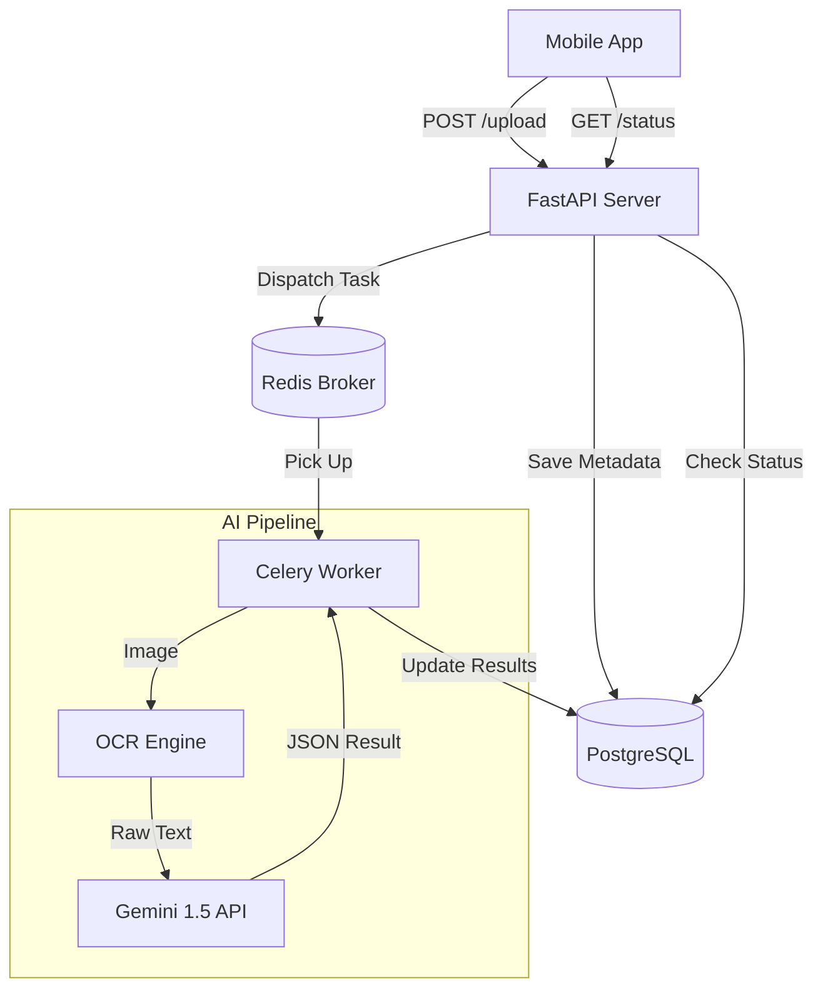

# Implementation Plan - Phase 24: OCR & AI Services (Async Workers)

Implement high-performance, asynchronous processing for medical documents and AI-driven analysis using **Celery**, **Redis**, and **Gemini 1.5**.

## User Review Required

> [!IMPORTANT]
> This phase introduces background task orchestration, which is essential for heavy-duty AI operations.
>
> - **Task Queue**: We will use **Celery** with **Redis** as a broker to handle long-running OCR and AI summarization tasks without blocking the main API thread.
> - **AI Integration**: Integration with the **Google Generative AI (Gemini)** Python SDK on the server side.
> - **OCR Engine**: Using **Tesseract** (or simulated via AI) for server-side text extraction from medical images/PDFs.
> - **Multimodal Support**: The system will support both image and text inputs for medical report interpretation.

## Proposed Changes

### Infrastructure Updates (`/`)

#### [MODIFY] [docker-compose.yml](file:///J:/Android/AndroidStudioProjects/Gemini/Ai-HealthCare-App/docker-compose.yml)
- Add a `worker` service to run Celery.
- Ensure `redis` is correctly linked to both `backend` and `worker`.

### Core AI & Task Logic (`backend/app/core`)

#### [NEW] [celery_app.py](file:///J:/Android/AndroidStudioProjects/Gemini/Ai-HealthCare-App/backend/app/core/celery_app.py)
- Initialize and configure the Celery application.

#### [NEW] [ai_engine.py](file:///J:/Android/AndroidStudioProjects/Gemini/Ai-HealthCare-App/backend/app/core/ai_engine.py)
- Wrapper for Gemini 1.5 Pro/Flash to handle medical reasoning and summarization.

### Background Tasks (`backend/app/tasks`)

#### [NEW] [medical_tasks.py](file:///J:/Android/AndroidStudioProjects/Gemini/Ai-HealthCare-App/backend/app/tasks/medical_tasks.py)
- `process_medical_report_task`: Handles OCR -> Analysis -> DB Update.
- `generate_health_summary_task`: Chronological analysis of patient history.

### API & Services (`backend/app/api/v1/endpoints`)

#### [NEW] [reports.py](file:///J:/Android/AndroidStudioProjects/Gemini/Ai-HealthCare-App/backend/app/api/v1/endpoints/reports.py)
- `POST /upload`: Upload a document and trigger an async processing task.
- `GET /{id}/status`: Check the status of a background task.

#### [NEW] [report_service.py](file:///J:/Android/AndroidStudioProjects/Gemini/Ai-HealthCare-App/backend/app/services/report_service.py)
- Manage file storage metadata and task initiation.

### Schemas (`backend/app/schemas`)

#### [NEW] [report.py](file:///J:/Android/AndroidStudioProjects/Gemini/Ai-HealthCare-App/backend/app/schemas/report.py)
- `ReportUploadResponse`, `ReportStatus`, `ReportAnalysisResult`.

## Architecture Diagram

## Verification Plan

### Automated Tests
- **Task Tests**: Verify that `process_medical_report_task` correctly updates the database upon completion.
- **AI Tests**: Mock Gemini API responses and verify the parsing of the structured JSON output.

### Manual Verification
- Upload a sample medical image via Swagger.
- Monitor Celery logs to ensure the task is picked up and processed.
- Verify that the processed AI summary appears in the database and is accessible via the API.
