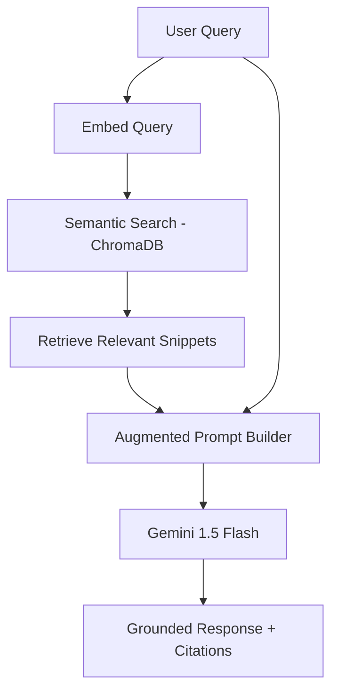

# Implementation Plan - Phase 25: RAG Pipeline with ChromaDB

Implement a sophisticated **Retrieval-Augmented Generation (RAG)** pipeline using **ChromaDB** and **Gemini 1.5** to ground the AI Medical Chatbot in authoritative medical knowledge.

## User Review Required

> [!IMPORTANT]
> This phase implements the "Brain" of the enterprise medical assistant.
>
> - **Vector Database**: We will use **ChromaDB** for high-performance semantic search.
> - **Embeddings**: We will use Gemini's embedding model to transform medical text into vectors.
> - **Knowledge Base**: We will initialize the system with WHO guidelines and hospital policy snippets.
> - **Citations**: The AI will be instructed to cite its sources from the retrieved context.

## Proposed Changes

### Data Modeling (`backend/app/models`)

#### [NEW] [chat.py](file:///J:/Android/AndroidStudioProjects/Gemini/Ai-HealthCare-App/backend/app/models/chat.py)
- `ChatMessage` model: Store conversation history (user_id, role, content, timestamp).

### Vector Store Core (`backend/app/core`)

#### [NEW] [chroma_db.py](file:///J:/Android/AndroidStudioProjects/Gemini/Ai-HealthCare-App/backend/app/core/chroma_db.py)
- Initialize the ChromaDB HTTP client and define collection management.

### RAG Service Layer (`backend/app/services`)

#### [NEW] [rag_service.py](file:///J:/Android/AndroidStudioProjects/Gemini/Ai-HealthCare-App/backend/app/services/rag_service.py)
- **Ingestion**: Logic to chunk and embed documents into ChromaDB.
- **Retrieval**: Perform semantic search to find top-K relevant contexts for a user query.
- **Initialization**: Method to seed the knowledge base with initial data.

#### [NEW] [chat_service.py](file:///J:/Android/AndroidStudioProjects/Gemini/Ai-HealthCare-App/backend/app/services/chat_service.py)
- Orchestrate the RAG flow:
    1. Search for context in ChromaDB.
    2. Build a context-aware prompt.
    3. Call Gemini 1.5 Flash for grounded response.
    4. Save conversation to PostgreSQL.

### API Endpoints (`backend/app/api/v1/endpoints`)

#### [NEW] [chat.py](file:///J:/Android/AndroidStudioProjects/Gemini/Ai-HealthCare-App/backend/app/api/v1/endpoints/chat.py)
- `POST /`: Send a message and get an AI response.
- `GET /history`: Retrieve previous conversation messages.

### Main App Updates

#### [MODIFY] [main.py](file:///J:/Android/AndroidStudioProjects/Gemini/Ai-HealthCare-App/backend/app/main.py)
- Register the `chat` router.
- Trigger Knowledge Base seeding on startup.

## RAG Pipeline Flow

## Verification Plan

### Automated Tests
- **RAG Tests**: Verify that querying for "Diabetes" returns the correct medical snippets from the knowledge base.
- **Embedding Tests**: Ensure vectors are correctly generated for arbitrary text.

### Manual Verification
- Use Swagger to ask "What are the visiting hours?" and verify the AI cites the hospital policy.
- Check the `mediai_chroma` container logs to monitor search performance.
