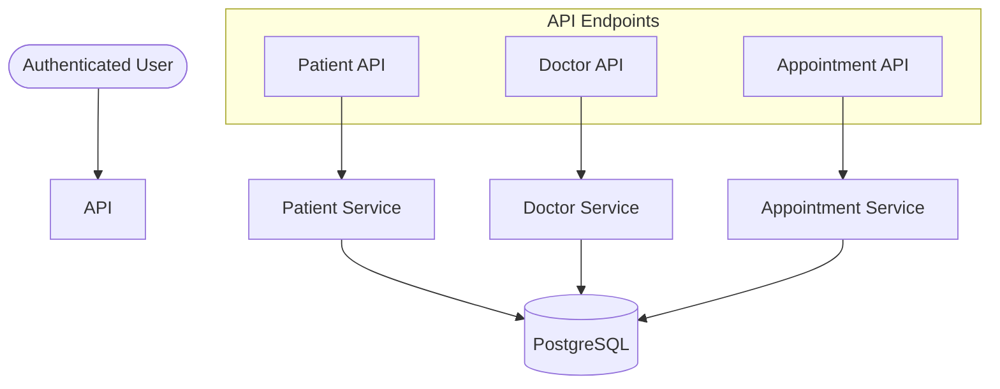

# Implementation Plan - Phase 23: Patient & Doctor Services

Implement the core healthcare management services for **MediAI Enterprise**, enabling patient profile management, doctor discovery, and appointment orchestration.

## User Review Required

> [!IMPORTANT]
> This phase implements the primary business logic for the healthcare platform.
>
> - **Data Ownership**: Patient profiles are strictly linked to the authenticated user. A user can only view/edit their own medical profile.
> - **Search Performance**: Doctor search will support partial name matching and specialization filtering.
> - **Appointment Logic**: Booking an appointment will verify the doctor's existence and store the scheduled time. (Advanced availability logic will be added in future AI phases).

## Proposed Changes

### API Schemas (`backend/app/schemas`)

#### [NEW] [patient.py](file:///J:/Android/AndroidStudioProjects/Gemini/Ai-HealthCare-App/backend/app/schemas/patient.py)
- `PatientProfileCreate`, `PatientProfileUpdate`, `PatientProfileResponse`.

#### [NEW] [doctor.py](file:///J:/Android/AndroidStudioProjects/Gemini/Ai-HealthCare-App/backend/app/schemas/doctor.py)
- `DoctorCreate`, `DoctorResponse`.

#### [NEW] [appointment.py](file:///J:/Android/AndroidStudioProjects/Gemini/Ai-HealthCare-App/backend/app/schemas/appointment.py)
- `AppointmentCreate`, `AppointmentUpdate`, `AppointmentResponse`.

### Service Layer (`backend/app/services`)

#### [NEW] [patient_service.py](file:///J:/Android/AndroidStudioProjects/Gemini/Ai-HealthCare-App/backend/app/services/patient_service.py)
- Business logic for managing patient profiles and medical metadata.

#### [NEW] [doctor_service.py](file:///J:/Android/AndroidStudioProjects/Gemini/Ai-HealthCare-App/backend/app/services/doctor_service.py)
- Logic for searching and filtering the doctor directory.

#### [NEW] [appointment_service.py](file:///J:/Android/AndroidStudioProjects/Gemini/Ai-HealthCare-App/backend/app/services/appointment_service.py)
- Logic for booking and retrieving appointments.

### API Endpoints (`backend/app/api/v1/endpoints`)

#### [NEW] [patients.py](file:///J:/Android/AndroidStudioProjects/Gemini/Ai-HealthCare-App/backend/app/api/v1/endpoints/patients.py)
- `GET /me/profile`: Fetch current user's profile.
- `PUT /me/profile`: Update medical details.

#### [NEW] [doctors.py](file:///J:/Android/AndroidStudioProjects/Gemini/Ai-HealthCare-App/backend/app/api/v1/endpoints/doctors.py)
- `GET /`: List and search doctors.
- `GET /{id}`: Fetch doctor details.

#### [NEW] [appointments.py](file:///J:/Android/AndroidStudioProjects/Gemini/Ai-HealthCare-App/backend/app/api/v1/endpoints/appointments.py)
- `POST /`: Book a new appointment.
- `GET /`: List user's appointments.

### Main App Updates

#### [MODIFY] [main.py](file:///J:/Android/AndroidStudioProjects/Gemini/Ai-HealthCare-App/backend/app/main.py)
- Register `patients`, `doctors`, and `appointments` routers.

## Architecture Diagram

## Verification Plan

### Automated Tests
- **Unit Tests**: Verify that `PatientProfileUpdate` correctly updates fields in the database.
- **Integration Tests**: Verify that searching for "Cardiologist" returns the correct doctors.

### Manual Verification
- Create a patient profile via Swagger.
- Search for doctors by specialization.
- Book an appointment and verify it appears in the user's appointment list.
