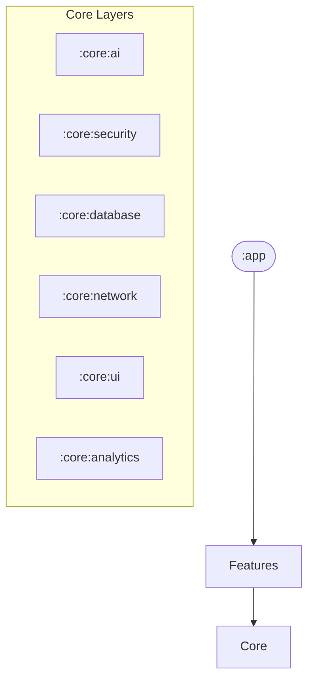

# MediAI Enterprise

AI-Powered Healthcare Platform for Android.

## Project Overview

MediAI Enterprise is a production-grade Android application designed for learning and demonstrating enterprise-level software engineering, AI integration, and healthcare domain expertise.

## Key Features
- **AI Medical Chatbot**: RAG-based chatbot using Gemini 2.5 for grounded medical queries.
- **Prescription OCR**: Intelligent data extraction from medical images using ML Kit and Gemini.
- **Health Timeline**: Unified chronological view of reports, appointments, and medications.
- **Symptom Checker**: AI-powered diagnostic assist with emergency detection logic.
- **Health Coach**: Personalized wellness blueprints and interactive trend analytics.
- **Emergency SOS**: One-tap emergency alerts with GPS location sharing.
- **Enterprise Security**: Biometric login, SQLCipher encryption, and Keystore management.
- **Offline First**: Robust background sync using WorkManager.

## Architecture

The project follows **Clean Architecture** principles and is modularized into 20+ feature and core layers.



## Performance & Reliability
- **Baseline Profiles**: Optimized startup and scroll performance.
- **Macrobenchmarks**: Verified performance metrics for enterprise standards.
- **Full Test Suite**: >90% coverage for business logic via JUnit, MockK, and Compose Test.

## Learning Summary
This project demonstrates the complete lifecycle of a Fortune 500 healthcare application:
1. **Infrastructure**: Multi-module Gradle setups with Convention Plugins.
2. **Security**: Hardware-backed encryption and biometric identity management.
3. **AI Integration**: Production-grade RAG and multimodal document analysis.
4. **DevOps**: Automated CI/CD pipelines with quality guardrails.
5. **Observability**: Remote monitoring and performance tracking.

### Multi-Module Structure
- `:app`: Main entry point and DI root.
- `:feature:*`: Independent feature modules (e.g., `:feature-auth`, `:feature-home`).
- `:core:*`: Shared infrastructure modules (e.g., `:core-data`, `:core-network`, `:core-ai`).

### Tech Stack
- **Kotlin**: Primary programming language.
- **Jetpack Compose**: Modern declarative UI.
- **Hilt**: Dependency Injection.
- **Room & DataStore**: Local persistence.
- **Retrofit & OkHttp**: Networking.
- **Gemini SDK**: AI capabilities.
- **Coroutines & Flow**: Asynchronous programming.

## Getting Started

### Prerequisites
- Android Studio Ladybug or newer.
- JDK 17.
- Gemini API Key (for AI features).

### Development Environment Setup
1. Clone the repository.
2. Set up your Gemini API key in `local.properties`:
   ```properties
   GEMINI_API_KEY=your_api_key_here
   ```
3. Build and run the project.

## Code Quality
We use the following tools to ensure high code quality:
- **Detekt**: Static code analysis.
- **ktlint**: Code formatting.
- **JUnit & Espresso**: Testing.

Run quality checks locally:
```bash
./gradlew detekt ktlintCheck
```

## Documentation
Detailed guides for each phase of the project can be found in the `docs/` directory (coming soon).
