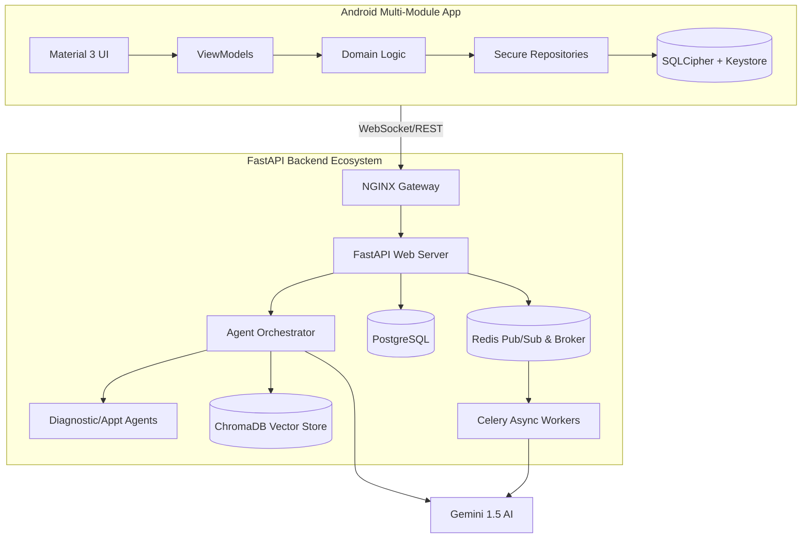

# MediAI Enterprise: Architecture Guide

## Overview
MediAI Enterprise follows a multi-module, Clean Architecture pattern designed for scalability, testability, and high-performance.

## Layers

### 1. Presentation Layer (UI)
- **Tech Stack**: Jetpack Compose, Material 3.
- **Pattern**: MVVM (Model-View-ViewModel) with Unidirectional Data Flow (UDF).
- **State Management**: StateFlow and SharedFlow.

### 2. Domain Layer (Business Logic)
- **Components**: UseCases, Domain Models, Repository Interfaces.
- **Purity**: Pure Kotlin/Java where possible to facilitate unit testing.

### 3. Data Layer (Data Access)
- **Components**: Repository Implementations, Mappers, Data Sources (Local Room DB, Remote Retrofit API).
- **Offline First**: All data is persisted locally first and synchronized in the background.

## Modularization Strategy
- **Feature Modules**: `:feature:auth`, `:feature:home`, `:feature:reports`, etc. Each feature is independent.
- **Core Modules**: `:core:common`, `:core:designsystem`, `:core:data`, `:core:ai`, `:core:security`. Shared logic and infrastructure.
- **Build Logic**: Centralized using Gradle Convention Plugins in `build-logic`.

## Full System Interaction

## Architectural Trade-offs
1. **Multi-Module vs. Monolith**: While multi-module increases build complexity and configuration overhead, it significantly improves parallel compilation times and enforces strict visibility boundaries, preventing "Spaghetti Code" in large teams.
2. **Clean Architecture overhead**: The abstraction of UseCases and Repositories adds boilerplate but makes the business logic 100% testable and independent of framework changes (e.g., swapping Room for another DB).
